# Free HTML Website Templates

14 free website templates, each in a single HTML file. Download one, change the text and photos, and your website is ready to upload. No WordPress, no page builder, no monthly fees.

**[See every template with a live demo and free download](https://mmrahmanbappi.github.io/free-html-templates/)**

## Why use these templates

- **One file each.** The CSS and JavaScript are inside the HTML file, so there is nothing to install or build.
- **Works on phones.** Every template adjusts to phones, tablets and desktops.
- **SEO ready.** Page titles, meta descriptions, social sharing tags and schema markup are already set up.
- **Real example text.** Written like a real business, not lorem ipsum, so you can see how your site will read.
- **Free for business use.** MIT license. Use them for your own site or for clients.

## Templates

| Preview | Template |
|---|---|
| [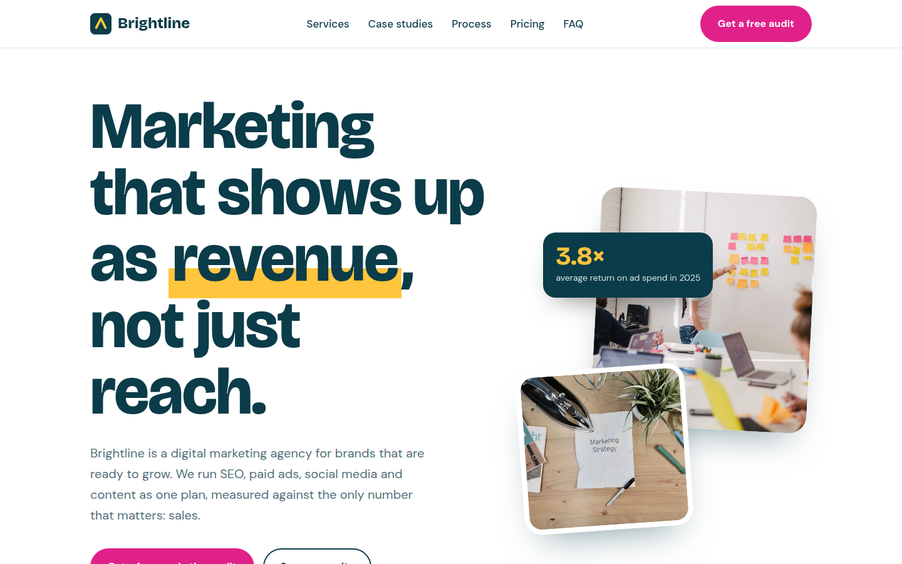](https://mmrahmanbappi.github.io/free-html-templates/business/digital-marketing-agency/) | **[Brightline](business/digital-marketing-agency/)** Digital Marketing Agency template  A bright, bold website for a marketing agency. It shows your services, past results, prices and team, and has a form so clients can book a free call.  [Live demo and download](https://mmrahmanbappi.github.io/free-html-templates/business/digital-marketing-agency/) |
| [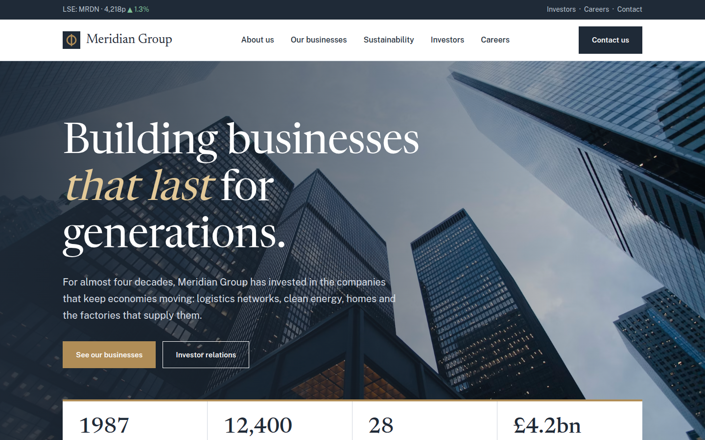](https://mmrahmanbappi.github.io/free-html-templates/business/corporate-company/) | **[Meridian Group](business/corporate-company/)** Corporate Company template  A calm, professional website for a large company or business group. It has a company profile, business divisions, history, leadership, news and a careers section.  [Live demo and download](https://mmrahmanbappi.github.io/free-html-templates/business/corporate-company/) |
| [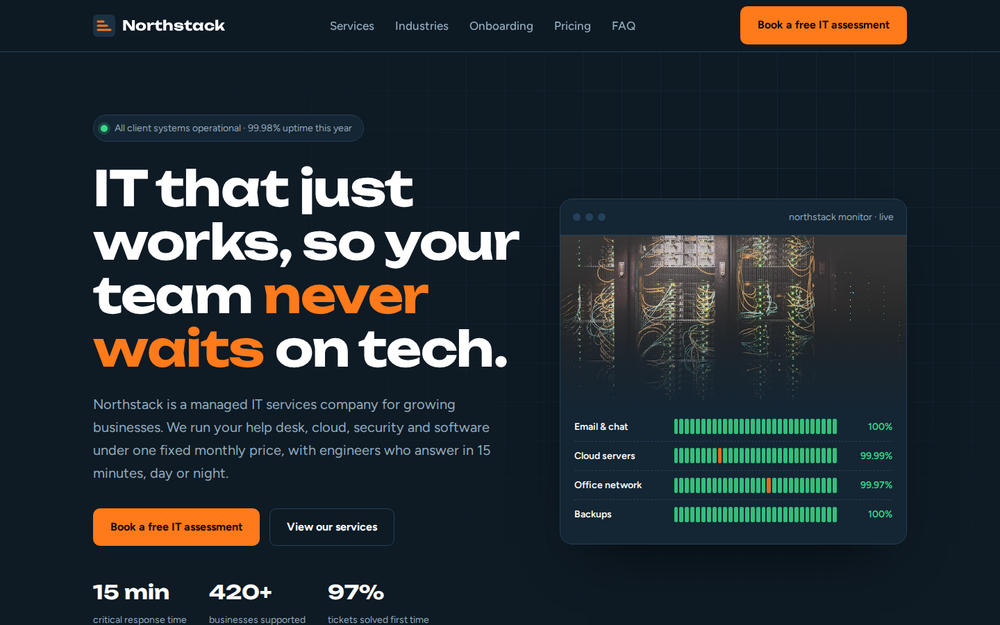](https://mmrahmanbappi.github.io/free-html-templates/business/it-service-company/) | **[Northstack](business/it-service-company/)** IT Service Company template  A dark, modern website for an IT support or tech company. It shows your services, response times, the industries you work with, prices and a booking form.  [Live demo and download](https://mmrahmanbappi.github.io/free-html-templates/business/it-service-company/) |
| [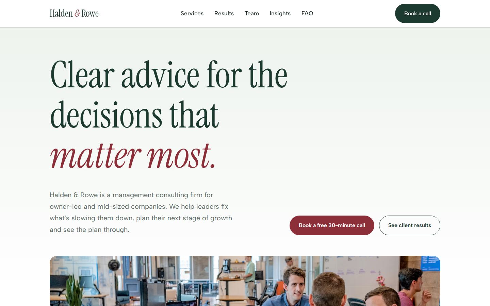](https://mmrahmanbappi.github.io/free-html-templates/business/consulting-firm/) | **[Halden & Rowe](business/consulting-firm/)** Consulting Firm template  A calm, trustworthy website for a business or management consultant. It explains the problems you solve, your services, client results, partners, articles and has a booking form.  [Live demo and download](https://mmrahmanbappi.github.io/free-html-templates/business/consulting-firm/) |
| [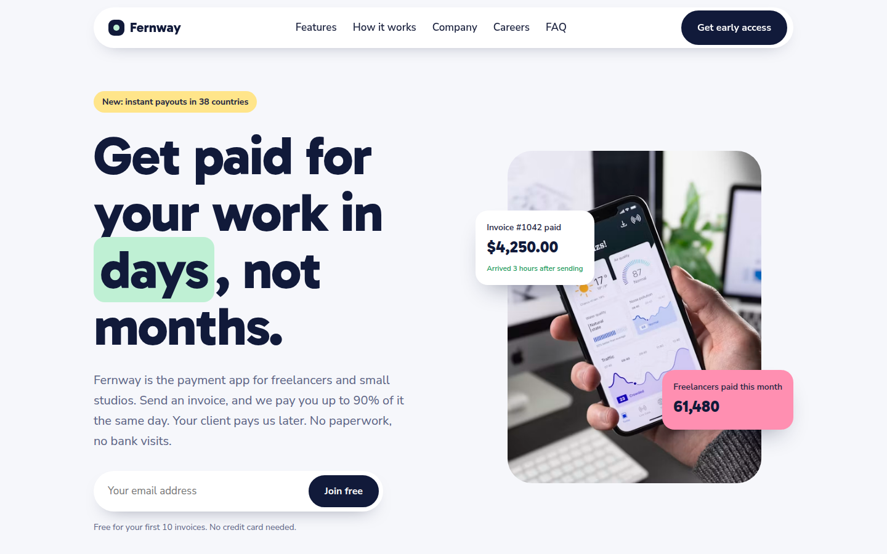](https://mmrahmanbappi.github.io/free-html-templates/business/startup-company/) | **[Fernway](business/startup-company/)** Startup Company template  A friendly, colourful website for a tech or app startup. It has a signup box, feature tiles, how it works, growth numbers, reviews, founders, a hiring banner and FAQ.  [Live demo and download](https://mmrahmanbappi.github.io/free-html-templates/business/startup-company/) |
| [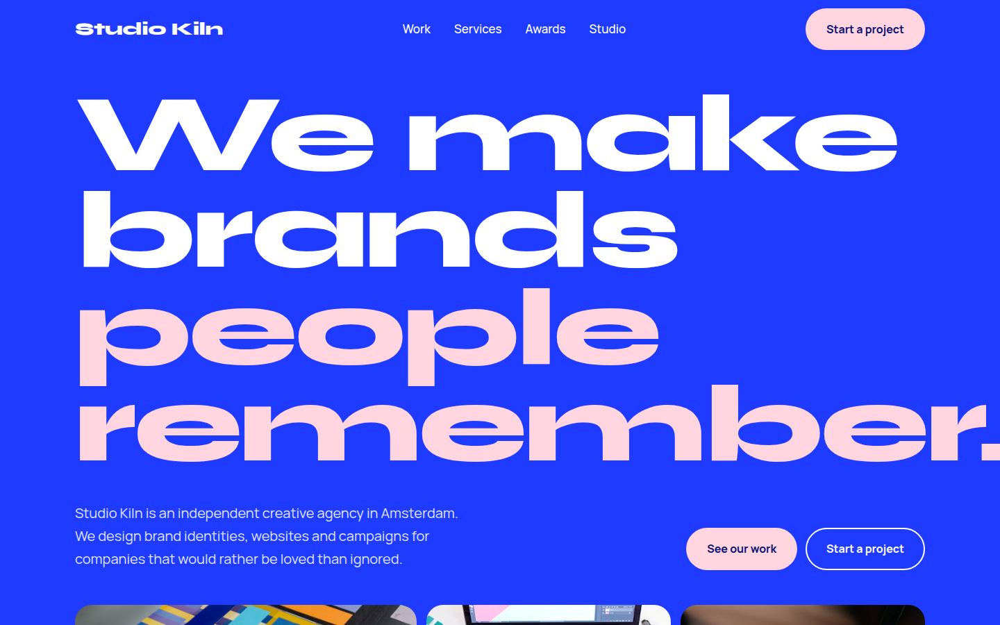](https://mmrahmanbappi.github.io/free-html-templates/business/creative-agency/) | **[Studio Kiln](business/creative-agency/)** Creative Agency template  A bold, big-type website for a design studio or branding agency. It shows your best projects, services, awards and team, with a project form that lets clients pick what they need.  [Live demo and download](https://mmrahmanbappi.github.io/free-html-templates/business/creative-agency/) |
| [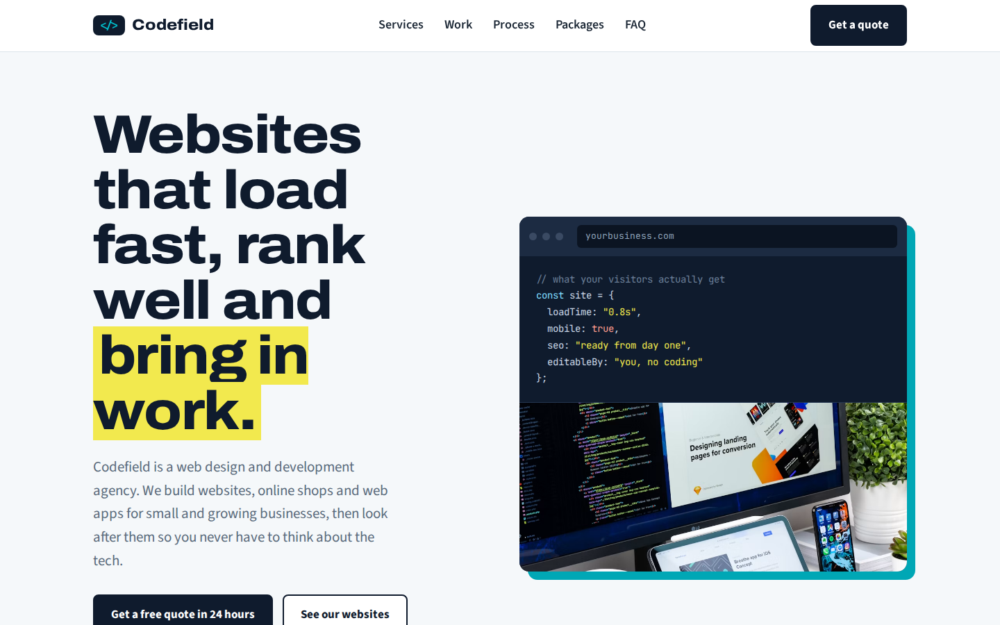](https://mmrahmanbappi.github.io/free-html-templates/business/web-development-agency/) | **[Codefield](business/web-development-agency/)** Web Development Agency template  A clean, sharp website for a web design and development company. It shows your services with starting prices, Google speed scores, recent websites, a 5-step process, packages and a quote form.  [Live demo and download](https://mmrahmanbappi.github.io/free-html-templates/business/web-development-agency/) |
| [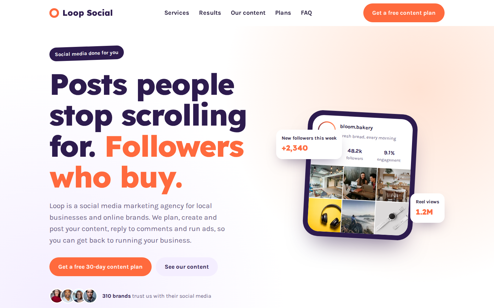](https://mmrahmanbappi.github.io/free-html-templates/business/social-media-marketing/) | **[Loop Social](business/social-media-marketing/)** Social Media Marketing Agency template  A fun, colourful website for a social media manager or agency. It has a phone mockup of a client profile, services, a follower growth chart, content samples, monthly plans and a free content plan form.  [Live demo and download](https://mmrahmanbappi.github.io/free-html-templates/business/social-media-marketing/) |
| [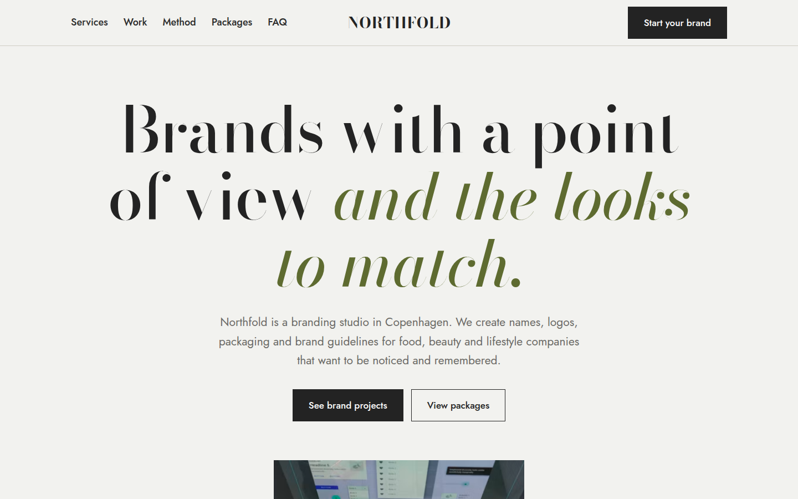](https://mmrahmanbappi.github.io/free-html-templates/business/branding-studio/) | **[Northfold](business/branding-studio/)** Branding Studio template  An elegant, minimal website for a branding or logo design studio. It shows your services, a sample brand kit with logo, colours and fonts, case studies, a 12-week method, packages and an enquiry form.  [Live demo and download](https://mmrahmanbappi.github.io/free-html-templates/business/branding-studio/) |
| [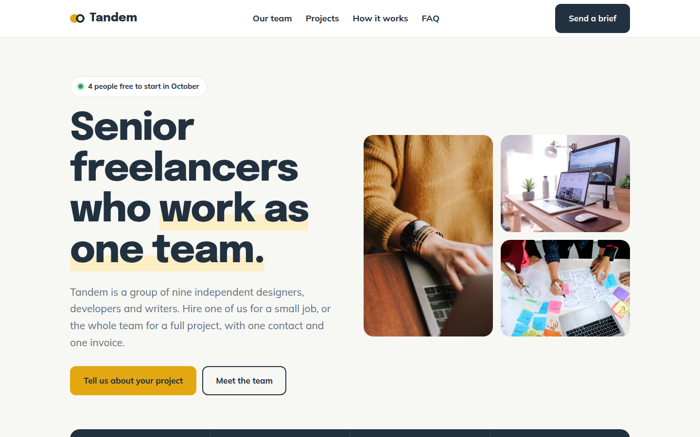](https://mmrahmanbappi.github.io/free-html-templates/business/freelancer-team/) | **[Tandem](business/freelancer-team/)** Freelancer Team template  A warm, people-first website for a group of freelancers or a small collective. It shows each person with skills, hourly rate and availability, plus projects, a price comparison table and a brief form.  [Live demo and download](https://mmrahmanbappi.github.io/free-html-templates/business/freelancer-team/) |
| [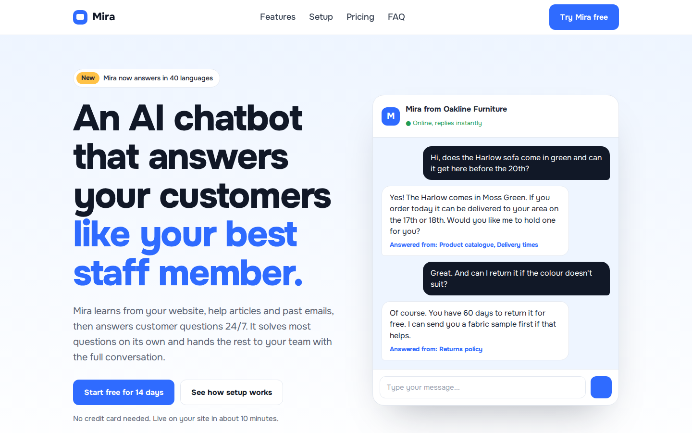](https://mmrahmanbappi.github.io/free-html-templates/saas-landing/ai-chatbot/) | **[Mira](saas-landing/ai-chatbot/)** AI Chatbot template  A bright, friendly landing page for an AI chatbot or AI tool. The hero shows a live chat demo, followed by features, 3-step setup with install code, integrations, use cases, pricing, data safety and FAQ.  [Live demo and download](https://mmrahmanbappi.github.io/free-html-templates/saas-landing/ai-chatbot/) |
|  | **[Relay](saas-landing/saas-product/)** SaaS Product template  A clean, green landing page for a software product. It has a full app preview built in HTML, feature sections with images, integrations, pricing with a monthly and yearly switch, a comparison table and FAQ.  [Live demo and download](https://mmrahmanbappi.github.io/free-html-templates/saas-landing/saas-product/) |
| [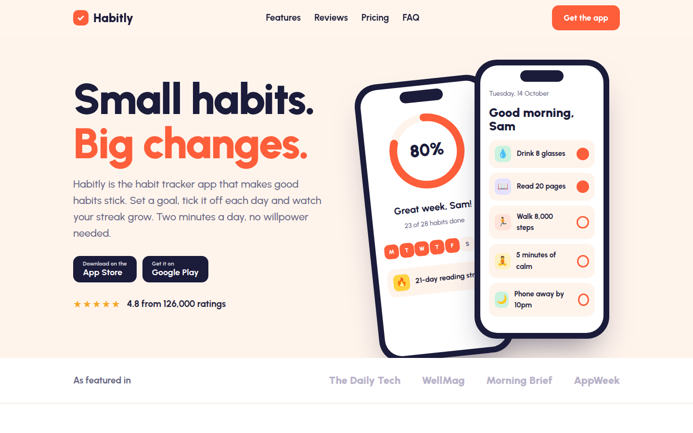](https://mmrahmanbappi.github.io/free-html-templates/saas-landing/mobile-app/) | **[Habitly](saas-landing/mobile-app/)** Mobile App template  A cheerful landing page for a mobile app. Two phone mockups built in HTML show real app screens, with app store buttons, features, reviews, free and premium plans, FAQ and a QR code download box.  [Live demo and download](https://mmrahmanbappi.github.io/free-html-templates/saas-landing/mobile-app/) |
| [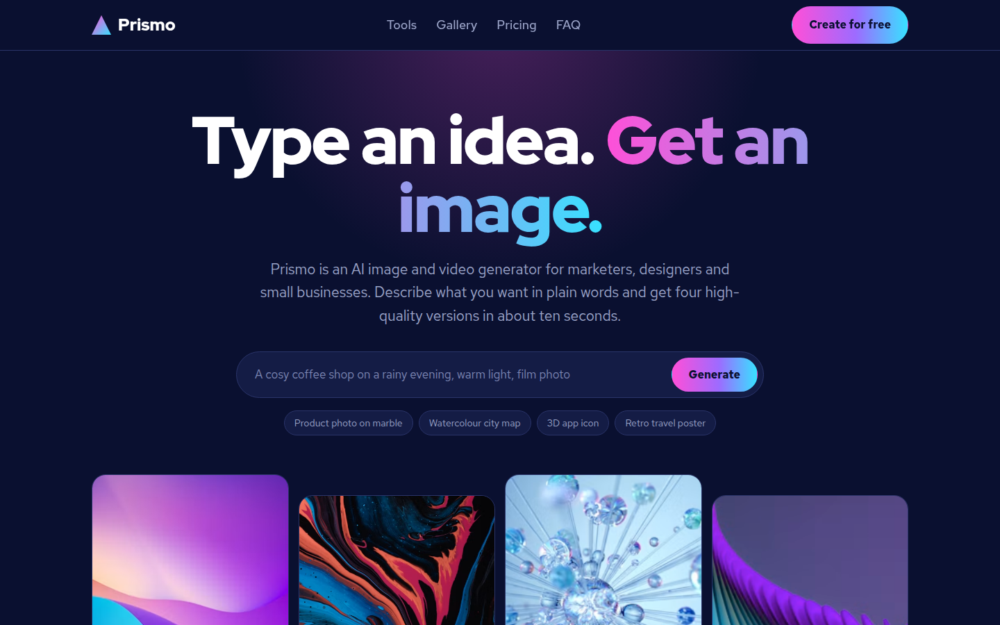](https://mmrahmanbappi.github.io/free-html-templates/saas-landing/ai-image-generator/) | **[Prismo](saas-landing/ai-image-generator/)** AI Image Generator template  A dark, colourful landing page for an AI image or video generator. It has a working prompt box with example prompts, a generated image grid, tools, a masonry gallery, credit-based pricing and FAQ.  [Live demo and download](https://mmrahmanbappi.github.io/free-html-templates/saas-landing/ai-image-generator/) |

## Categories

- **[Business](business/)** (10 templates): 10 free business website templates in one HTML file: digital marketing agency, corporate company, IT service company and more. Mobile friendly and SEO ready.
- **[AI & SaaS](saas-landing/)** (4 templates): 4 free AI & SaaS website templates in one HTML file: AI chatbot, SaaS product, mobile app, AI image generator. Mobile friendly and SEO ready.

New templates are added every week. Coming next: more AI and SaaS pages, admin dashboards, online shops, portfolios, restaurants, clinics, schools, real estate and wedding sites.

## How to use a template

1. Go to the [template gallery](https://mmrahmanbappi.github.io/free-html-templates/), open a live demo and click **Download this template (free)**.
2. Open the file in a text editor such as VS Code or Notepad++.
3. Change the text, colours and photos. Colours are listed at the top of the `<style>` block.
4. Upload the file to GitHub Pages, Netlify, Cloudflare Pages or your own web host.

## Questions

**Are these HTML templates really free?** Yes. Every template is free for personal and commercial use under the MIT license. You don't need to sign up, pay or add a credit link.

**Do I need to know coding to use them?** No. Basic editing is enough. Open the index.html file in a text editor such as VS Code or Notepad, change the words, phone numbers and image links, then save the file.

**How do I put a template online for free?** Upload the index.html file to GitHub Pages, Netlify or Cloudflare Pages. All three have free plans and take about ten minutes to set up.

**Can I use a template for a client's website?** Yes. The MIT license lets you use, change and sell websites built with these templates, including work you do for clients.

**Are the templates good for SEO?** Yes. Each template has a page title and description, social sharing tags, schema markup, alt text on every image and a clear heading order, so Google can read and rank the page.

**Will the templates work on mobile phones?** Yes. Every template adjusts to phones, tablets and desktop screens, and has been checked at common screen sizes.

## Credits

Photos from [Unsplash](https://unsplash.com) under the Unsplash License. Fonts from [Google Fonts](https://fonts.google.com).

## License

[MIT](LICENSE). Free for personal and commercial use. If a template saved you time, please star this repository so more people can find it.
