# Free HTML Website Templates

100 free website templates, each in a single HTML file. Download one, change the text and photos, and your website is ready to upload. No WordPress, no page builder, no monthly fees.

**[See every template with a live demo and free download](https://mmrahmanbappi.github.io/free-html-templates/)**

## Why use these templates

- **One file each.** The CSS and JavaScript are inside the HTML file, so there is nothing to install or build.
- **Works on phones.** Every template adjusts to phones, tablets and desktops.
- **SEO ready.** Page titles, meta descriptions, social sharing tags and schema markup are already set up.
- **Real example text.** Written like a real business, not lorem ipsum, so you can see how your site will read.
- **Free for business use.** MIT license. Use them for your own site or for clients.

## Templates

| Preview | Template |
|---|---|
|  | **[Brightline](business/digital-marketing-agency/)** Digital Marketing Agency template  A bright, bold website for a marketing agency. It shows your services, past results, prices and team, and has a form so clients can book a free call.  [Live demo and download](https://mmrahmanbappi.github.io/free-html-templates/business/digital-marketing-agency/) |
|  | **[Meridian Group](business/corporate-company/)** Corporate Company template  A calm, professional website for a large company or business group. It has a company profile, business divisions, history, leadership, news and a careers section.  [Live demo and download](https://mmrahmanbappi.github.io/free-html-templates/business/corporate-company/) |
|  | **[Northstack](business/it-service-company/)** IT Service Company template  A dark, modern website for an IT support or tech company. It shows your services, response times, the industries you work with, prices and a booking form.  [Live demo and download](https://mmrahmanbappi.github.io/free-html-templates/business/it-service-company/) |
|  | **[Halden & Rowe](business/consulting-firm/)** Consulting Firm template  A calm, trustworthy website for a business or management consultant. It explains the problems you solve, your services, client results, partners, articles and has a booking form.  [Live demo and download](https://mmrahmanbappi.github.io/free-html-templates/business/consulting-firm/) |
|  | **[Fernway](business/startup-company/)** Startup Company template  A friendly, colourful website for a tech or app startup. It has a signup box, feature tiles, how it works, growth numbers, reviews, founders, a hiring banner and FAQ.  [Live demo and download](https://mmrahmanbappi.github.io/free-html-templates/business/startup-company/) |
|  | **[Studio Kiln](business/creative-agency/)** Creative Agency template  A bold, big-type website for a design studio or branding agency. It shows your best projects, services, awards and team, with a project form that lets clients pick what they need.  [Live demo and download](https://mmrahmanbappi.github.io/free-html-templates/business/creative-agency/) |
|  | **[Codefield](business/web-development-agency/)** Web Development Agency template  A clean, sharp website for a web design and development company. It shows your services with starting prices, Google speed scores, recent websites, a 5-step process, packages and a quote form.  [Live demo and download](https://mmrahmanbappi.github.io/free-html-templates/business/web-development-agency/) |
|  | **[Loop Social](business/social-media-marketing/)** Social Media Marketing Agency template  A fun, colourful website for a social media manager or agency. It has a phone mockup of a client profile, services, a follower growth chart, content samples, monthly plans and a free content plan form.  [Live demo and download](https://mmrahmanbappi.github.io/free-html-templates/business/social-media-marketing/) |
|  | **[Northfold](business/branding-studio/)** Branding Studio template  An elegant, minimal website for a branding or logo design studio. It shows your services, a sample brand kit with logo, colours and fonts, case studies, a 12-week method, packages and an enquiry form.  [Live demo and download](https://mmrahmanbappi.github.io/free-html-templates/business/branding-studio/) |
|  | **[Tandem](business/freelancer-team/)** Freelancer Team template  A warm, people-first website for a group of freelancers or a small collective. It shows each person with skills, hourly rate and availability, plus projects, a price comparison table and a brief form.  [Live demo and download](https://mmrahmanbappi.github.io/free-html-templates/business/freelancer-team/) |
|  | **[Mira](saas-landing/ai-chatbot/)** AI Chatbot template  A bright, friendly landing page for an AI chatbot or AI tool. The hero shows a live chat demo, followed by features, 3-step setup with install code, integrations, use cases, pricing, data safety and FAQ.  [Live demo and download](https://mmrahmanbappi.github.io/free-html-templates/saas-landing/ai-chatbot/) |
|  | **[Relay](saas-landing/saas-product/)** SaaS Product template  A clean, green landing page for a software product. It has a full app preview built in HTML, feature sections with images, integrations, pricing with a monthly and yearly switch, a comparison table and FAQ.  [Live demo and download](https://mmrahmanbappi.github.io/free-html-templates/saas-landing/saas-product/) |
|  | **[Habitly](saas-landing/mobile-app/)** Mobile App template  A cheerful landing page for a mobile app. Two phone mockups built in HTML show real app screens, with app store buttons, features, reviews, free and premium plans, FAQ and a QR code download box.  [Live demo and download](https://mmrahmanbappi.github.io/free-html-templates/saas-landing/mobile-app/) |
|  | **[Prismo](saas-landing/ai-image-generator/)** AI Image Generator template  A dark, colourful landing page for an AI image or video generator. It has a working prompt box with example prompts, a generated image grid, tools, a masonry gallery, credit-based pricing and FAQ.  [Live demo and download](https://mmrahmanbappi.github.io/free-html-templates/saas-landing/ai-image-generator/) |
| [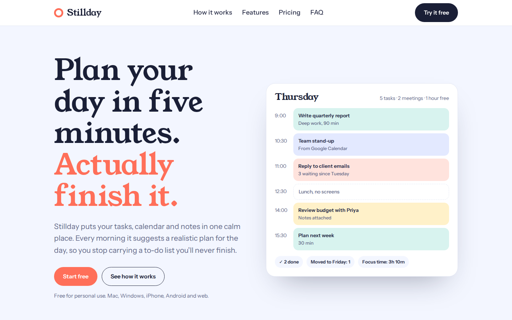](https://mmrahmanbappi.github.io/free-html-templates/saas-landing/productivity-app/) | **[Stillday](saas-landing/productivity-app/)** Productivity App template  A calm, friendly landing page for a planner, to-do or notes app. The hero shows a full day plan built in HTML, with a 3-step method, feature sections, results, reviews, pricing and FAQ.  [Live demo and download](https://mmrahmanbappi.github.io/free-html-templates/saas-landing/productivity-app/) |
| [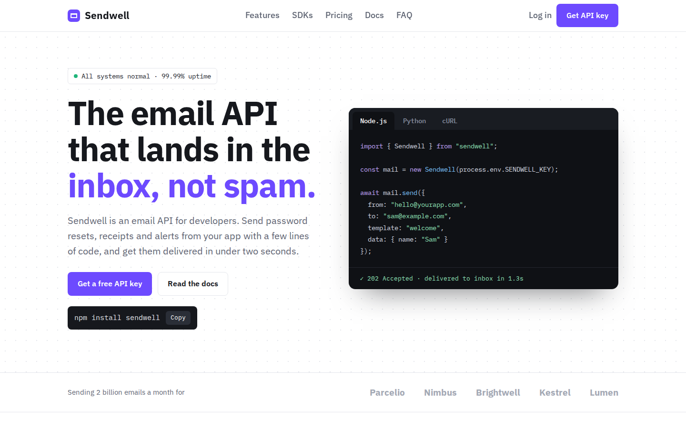](https://mmrahmanbappi.github.io/free-html-templates/saas-landing/developer-api/) | **[Sendwell](saas-landing/developer-api/)** Developer Tool and API template  A clean landing page for an API or developer tool. It has code examples with working Node.js, Python and cURL tabs, a copy-to-clipboard install command, uptime bars, SDK list, usage pricing and FAQ.  [Live demo and download](https://mmrahmanbappi.github.io/free-html-templates/saas-landing/developer-api/) |
| [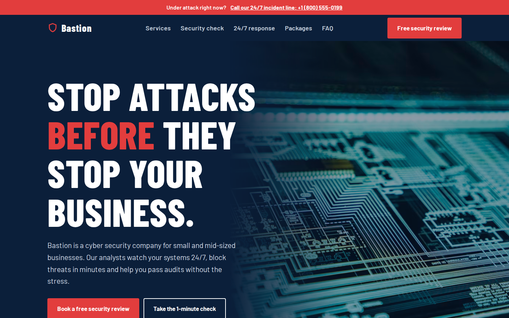](https://mmrahmanbappi.github.io/free-html-templates/saas-landing/cyber-security/) | **[Bastion](saas-landing/cyber-security/)** Cyber Security template  A strong, serious website for a cyber security company. It has an emergency hotline bar, threat numbers, services, a working 1-minute security self-check with score, incident timeline, packages and FAQ.  [Live demo and download](https://mmrahmanbappi.github.io/free-html-templates/saas-landing/cyber-security/) |
| [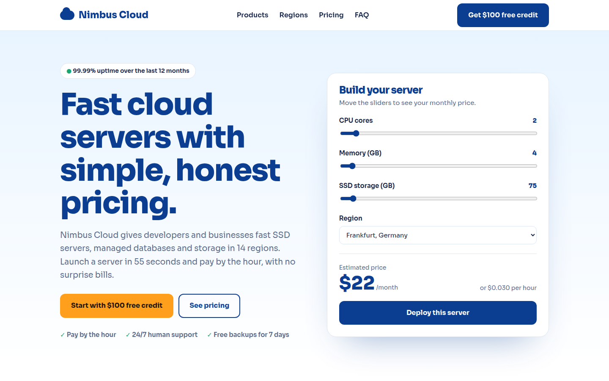](https://mmrahmanbappi.github.io/free-html-templates/saas-landing/cloud-hosting/) | **[Nimbus Cloud](saas-landing/cloud-hosting/)** Cloud Hosting template  A bright landing page for a cloud hosting or VPS company. The hero has a working server price calculator with sliders, followed by products, data centre regions, server plans, reviews and FAQ.  [Live demo and download](https://mmrahmanbappi.github.io/free-html-templates/saas-landing/cloud-hosting/) |
| [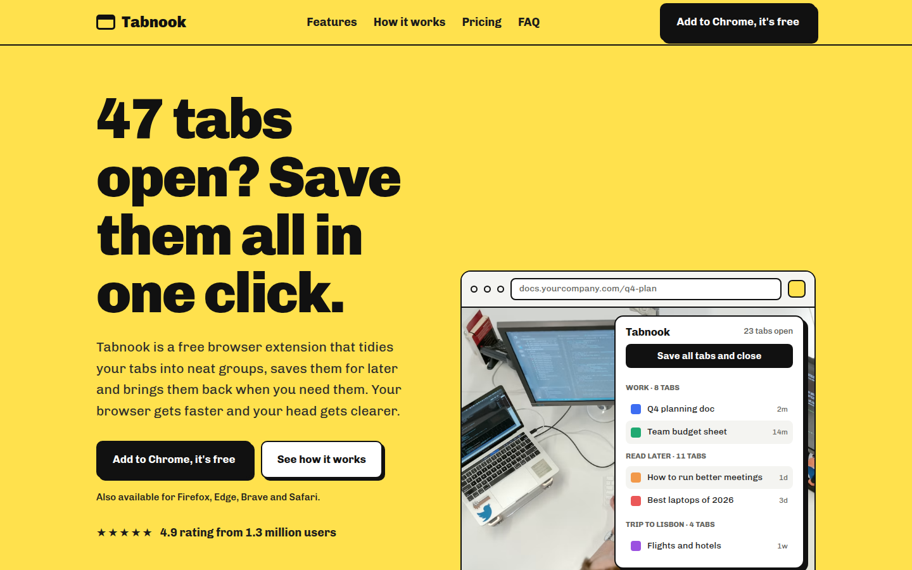](https://mmrahmanbappi.github.io/free-html-templates/saas-landing/chrome-extension/) | **[Tabnook](saas-landing/chrome-extension/)** Chrome Extension template  A bold, playful landing page for a browser extension. A browser window built in HTML shows the extension popup, with features, a before and after comparison, install steps, reviews, plans and FAQ.  [Live demo and download](https://mmrahmanbappi.github.io/free-html-templates/saas-landing/chrome-extension/) |
| [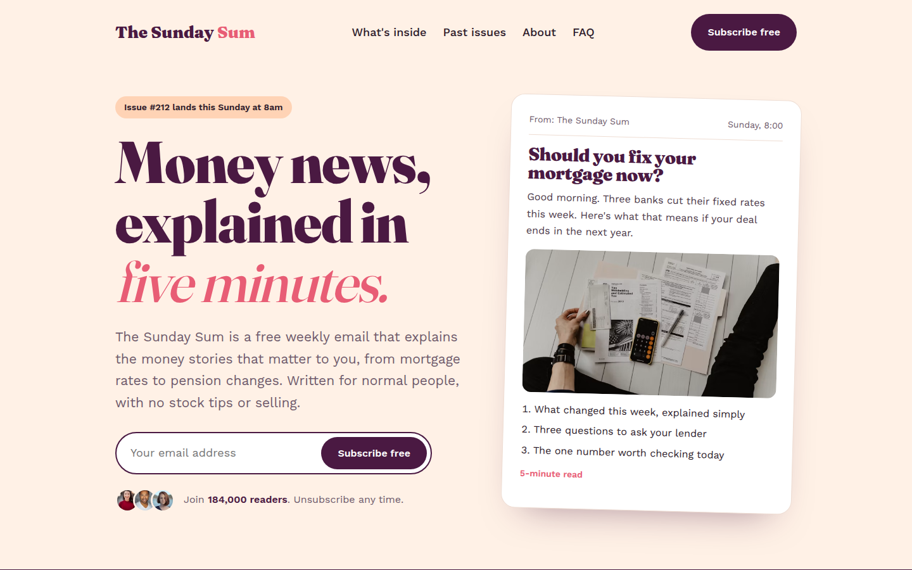](https://mmrahmanbappi.github.io/free-html-templates/saas-landing/newsletter-waitlist/) | **[The Sunday Sum](saas-landing/newsletter-waitlist/)** Newsletter and Waitlist template  A warm, readable landing page for an email newsletter or product waitlist. It has a signup box, a sample issue preview, reader numbers, past issues, an author section, referral rewards and FAQ.  [Live demo and download](https://mmrahmanbappi.github.io/free-html-templates/saas-landing/newsletter-waitlist/) |
| [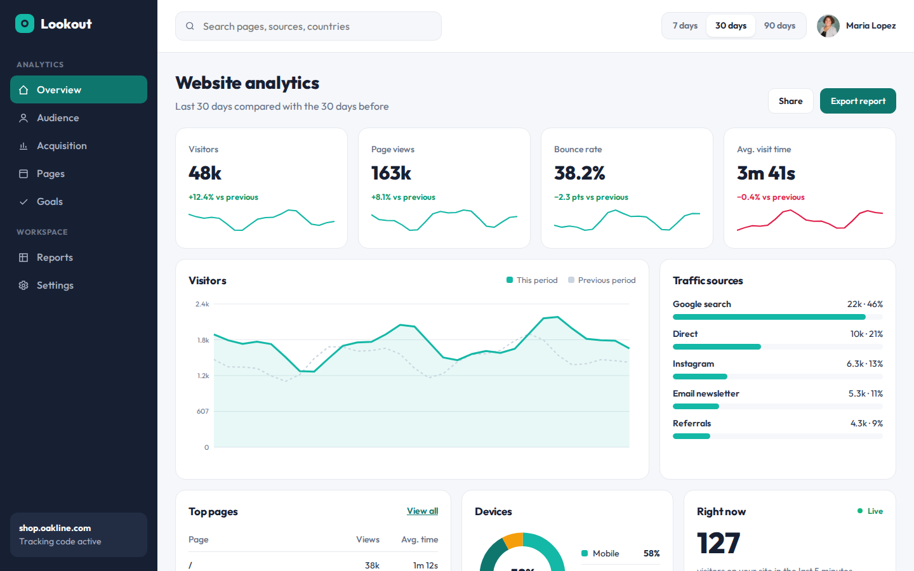](https://mmrahmanbappi.github.io/free-html-templates/admin-dashboard/analytics-dashboard/) | **[Lookout](admin-dashboard/analytics-dashboard/)** Analytics Dashboard template  A clean website analytics dashboard with a dark sidebar. KPI cards with sparklines, a visitors line chart that changes with the 7, 30 and 90 day buttons, traffic sources, devices donut, top pages and live visitors.  [Live demo and download](https://mmrahmanbappi.github.io/free-html-templates/admin-dashboard/analytics-dashboard/) |
| [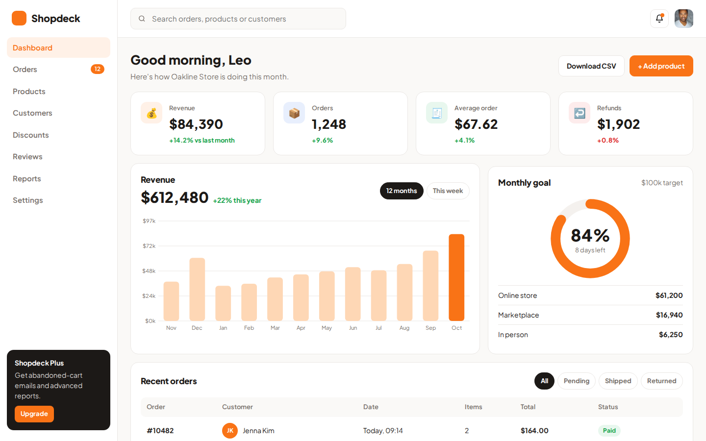](https://mmrahmanbappi.github.io/free-html-templates/admin-dashboard/ecommerce-admin/) | **[Shopdeck](admin-dashboard/ecommerce-admin/)** E-commerce Admin Dashboard template  A friendly admin dashboard for an online store. It has sales cards, a revenue bar chart with 12 month and weekly views, a monthly goal ring, an orders table with working status filters, best sellers, low stock and reviews.  [Live demo and download](https://mmrahmanbappi.github.io/free-html-templates/admin-dashboard/ecommerce-admin/) |
| [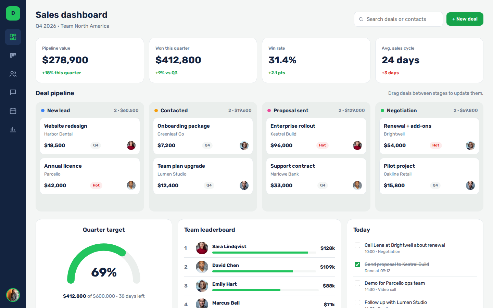](https://mmrahmanbappi.github.io/free-html-templates/admin-dashboard/crm-dashboard/) | **[Dealflow](admin-dashboard/crm-dashboard/)** CRM Dashboard template  A sales and CRM dashboard with an icon sidebar. The deal pipeline is a working drag and drop board that updates stage totals, plus a quarter target gauge, team leaderboard, task checklist and activity feed.  [Live demo and download](https://mmrahmanbappi.github.io/free-html-templates/admin-dashboard/crm-dashboard/) |
| [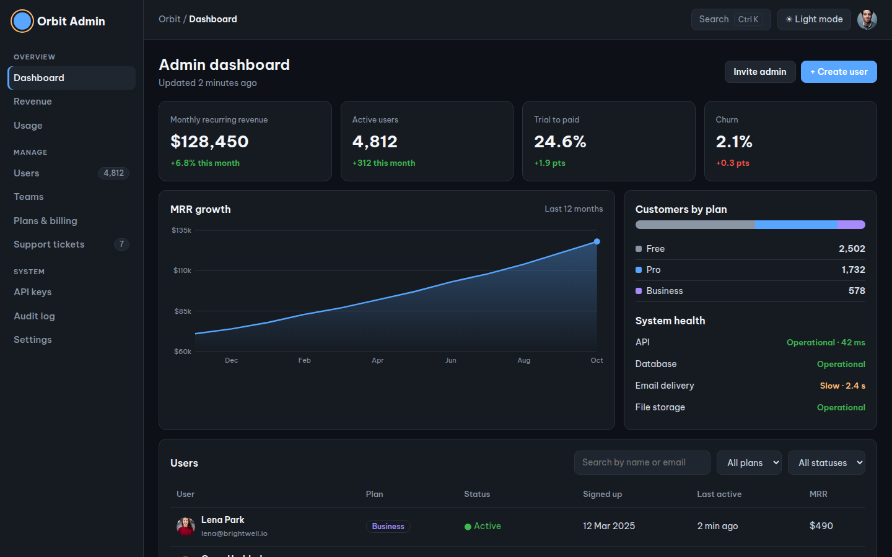](https://mmrahmanbappi.github.io/free-html-templates/admin-dashboard/saas-admin-panel/) | **[Orbit Admin](admin-dashboard/saas-admin-panel/)** SaaS Admin Panel template  A dark admin panel for a SaaS product with a light mode switch. It has an MRR area chart, customers by plan, system health, a users table with working search and filters, settings toggles and an audit log.  [Live demo and download](https://mmrahmanbappi.github.io/free-html-templates/admin-dashboard/saas-admin-panel/) |
| [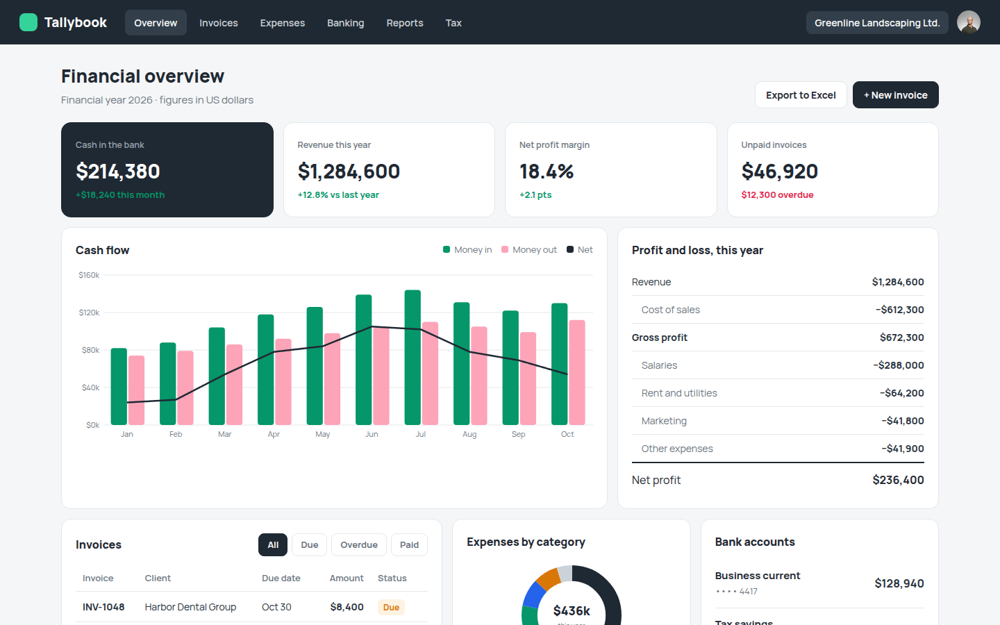](https://mmrahmanbappi.github.io/free-html-templates/admin-dashboard/finance-dashboard/) | **[Tallybook](admin-dashboard/finance-dashboard/)** Finance Dashboard template  A clear finance and accounting dashboard with a top navigation bar. It has a cash flow chart with money in, money out and net line, a profit and loss table, invoices with working status filters, an expenses donut and bank balances.  [Live demo and download](https://mmrahmanbappi.github.io/free-html-templates/admin-dashboard/finance-dashboard/) |
| [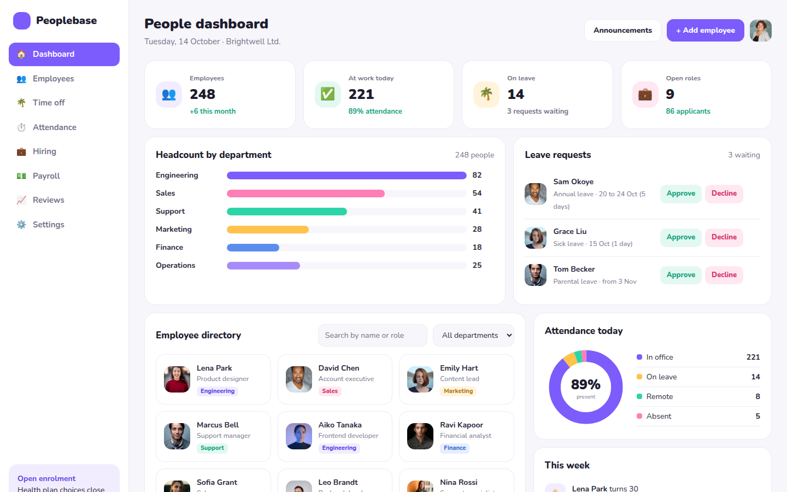](https://mmrahmanbappi.github.io/free-html-templates/admin-dashboard/hr-dashboard/) | **[Peoplebase](admin-dashboard/hr-dashboard/)** HR Dashboard template  A friendly HR and employee management dashboard. Leave requests can be approved or declined with one click, the staff directory has working search and department filters, plus headcount, attendance and hiring.  [Live demo and download](https://mmrahmanbappi.github.io/free-html-templates/admin-dashboard/hr-dashboard/) |
| [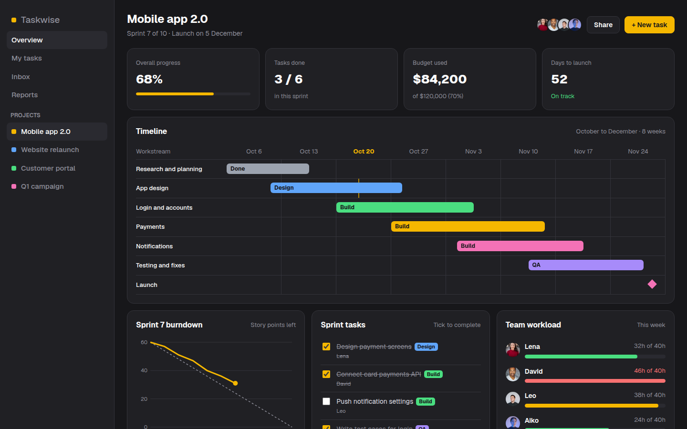](https://mmrahmanbappi.github.io/free-html-templates/admin-dashboard/project-management/) | **[Taskwise](admin-dashboard/project-management/)** Project Management Dashboard template  A dark project management dashboard with a Gantt timeline showing workstreams and a launch milestone. Ticking sprint tasks updates the progress numbers live, with a burndown chart and team workload bars.  [Live demo and download](https://mmrahmanbappi.github.io/free-html-templates/admin-dashboard/project-management/) |
| [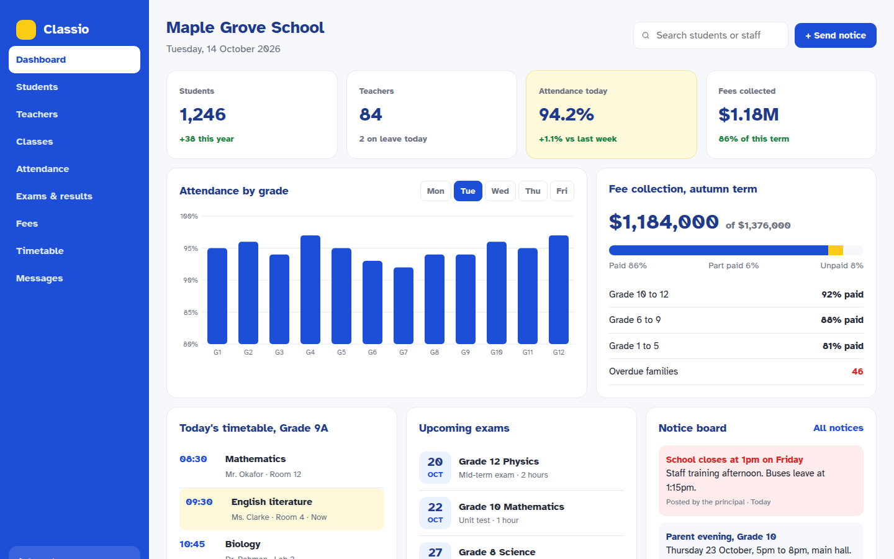](https://mmrahmanbappi.github.io/free-html-templates/admin-dashboard/school-management/) | **[Classio](admin-dashboard/school-management/)** School Management Dashboard template  An easy-to-read school management dashboard using an extra-legible font. It shows attendance by grade with day buttons, fee collection progress, a class timetable, upcoming exams, top students and a notice board.  [Live demo and download](https://mmrahmanbappi.github.io/free-html-templates/admin-dashboard/school-management/) |
| [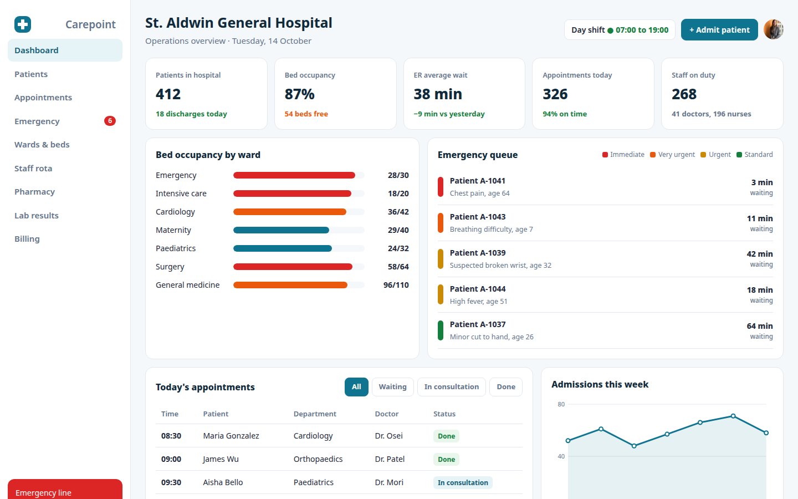](https://mmrahmanbappi.github.io/free-html-templates/admin-dashboard/hospital-management/) | **[Carepoint](admin-dashboard/hospital-management/)** Hospital Management Dashboard template  A calm, clinical hospital operations dashboard. It shows bed occupancy by ward with colour warnings, an emergency queue by triage level with live wait times, appointments with status filters, admissions and doctors on duty.  [Live demo and download](https://mmrahmanbappi.github.io/free-html-templates/admin-dashboard/hospital-management/) |
| [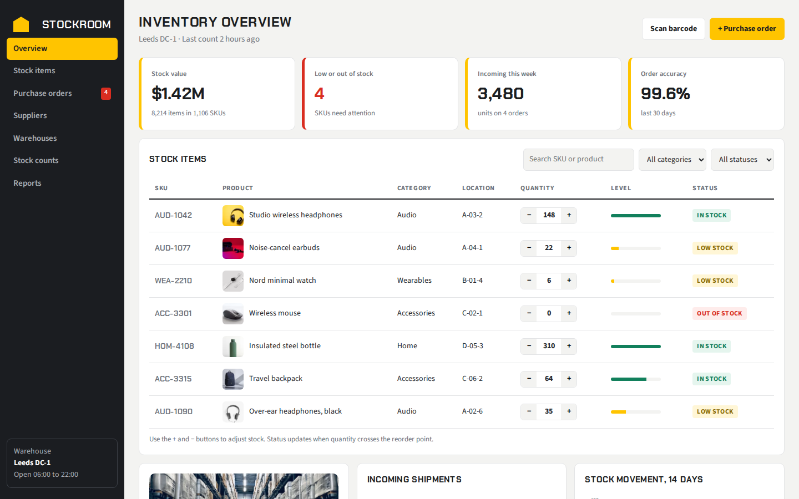](https://mmrahmanbappi.github.io/free-html-templates/admin-dashboard/inventory-dashboard/) | **[Stockroom](admin-dashboard/inventory-dashboard/)** Inventory Dashboard template  An industrial-style inventory and stock dashboard. The stock table has working search, category and status filters, plus + and − buttons that update stock status and reorder suggestions live. Also shows zones and shipments.  [Live demo and download](https://mmrahmanbappi.github.io/free-html-templates/admin-dashboard/inventory-dashboard/) |
| [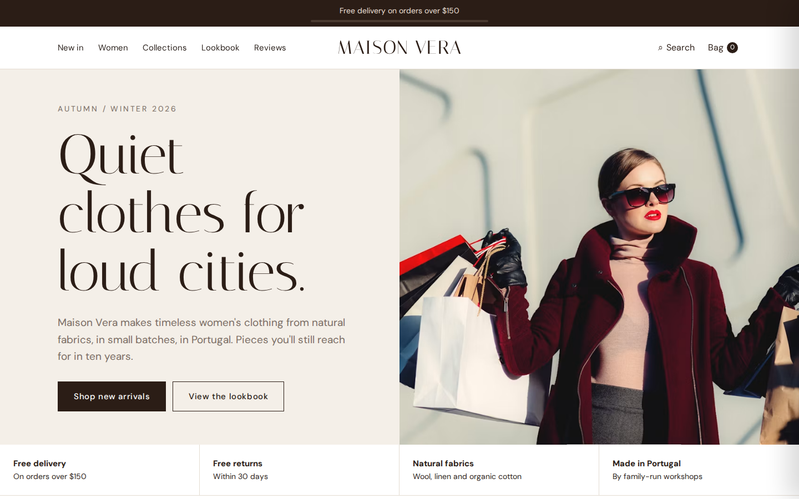](https://mmrahmanbappi.github.io/free-html-templates/ecommerce/fashion-store/) | **[Maison Vera](ecommerce/fashion-store/)** Fashion Store template  An elegant clothing boutique template. Products can be filtered by category and added to a working shopping bag that slides in, with quantities, subtotal and a free delivery progress bar at the top.  [Live demo and download](https://mmrahmanbappi.github.io/free-html-templates/ecommerce/fashion-store/) |
| [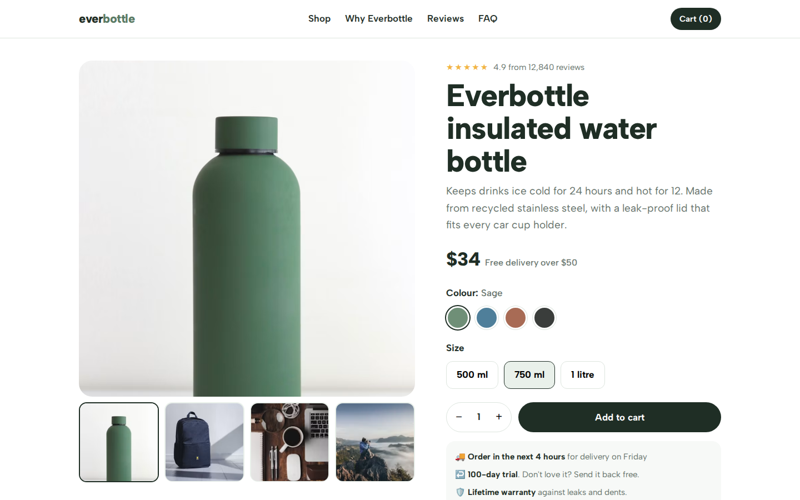](https://mmrahmanbappi.github.io/free-html-templates/ecommerce/single-product-store/) | **[Everbottle](ecommerce/single-product-store/)** Single Product Store template  A full product page for a one-product brand. It has a photo gallery, colour swatches that change the product photo, size buttons that change the price, a quantity picker, a sticky buy bar, a savings calculator, reviews and FAQ.  [Live demo and download](https://mmrahmanbappi.github.io/free-html-templates/ecommerce/single-product-store/) |
| [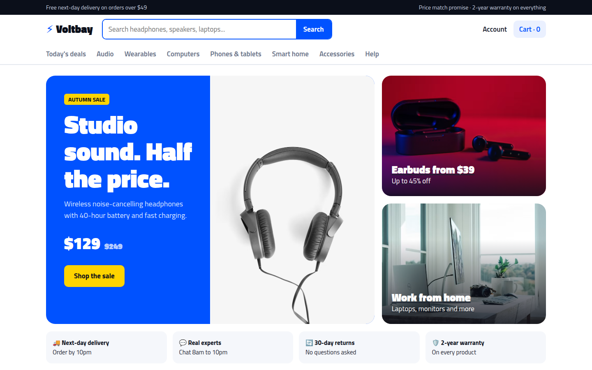](https://mmrahmanbappi.github.io/free-html-templates/ecommerce/electronics-store/) | **[Voltbay](ecommerce/electronics-store/)** Electronics Store template  A bright tech and gadget store template. It has a live deal countdown, sale banners, category tiles, product cards with ratings, working add to cart and a compare feature for up to three products.  [Live demo and download](https://mmrahmanbappi.github.io/free-html-templates/ecommerce/electronics-store/) |
| [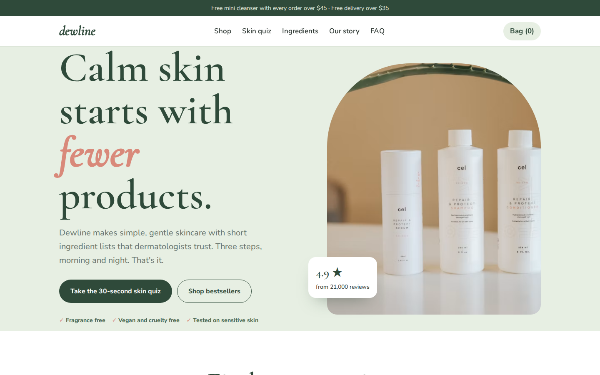](https://mmrahmanbappi.github.io/free-html-templates/ecommerce/cosmetics-skincare-store/) | **[Dewline](ecommerce/cosmetics-skincare-store/)** Skincare and Cosmetics Store template  A soft, calm skincare brand store. A working 3-question skin quiz suggests a personal routine you can add to the bag in one click, plus bestsellers, key ingredients, brand story, reviews and FAQ.  [Live demo and download](https://mmrahmanbappi.github.io/free-html-templates/ecommerce/cosmetics-skincare-store/) |
| [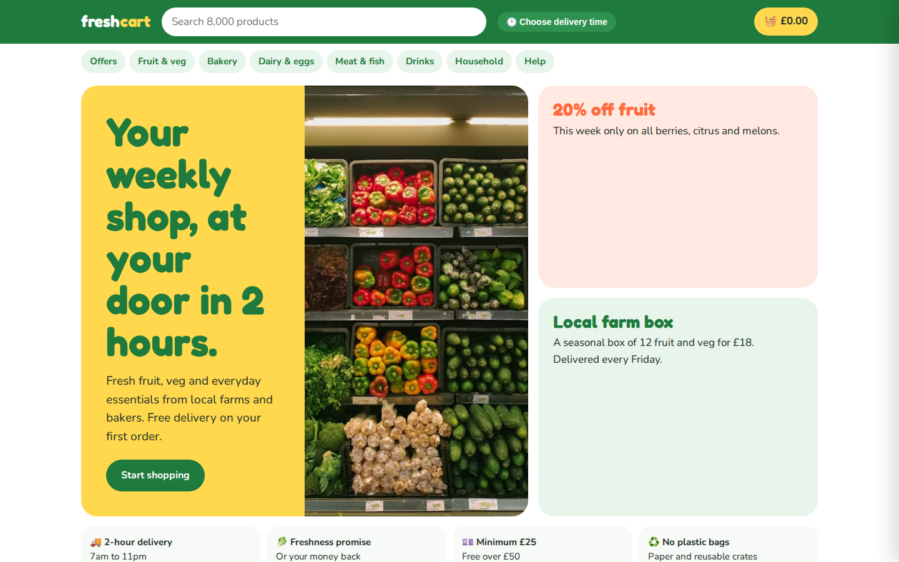](https://mmrahmanbappi.github.io/free-html-templates/ecommerce/grocery-store/) | **[Freshcart](ecommerce/grocery-store/)** Grocery Store template  A cheerful online grocery store. Products can be added with + and − buttons, the basket shows totals and how much more is needed for free delivery, and customers can pick a delivery time slot.  [Live demo and download](https://mmrahmanbappi.github.io/free-html-templates/ecommerce/grocery-store/) |
| [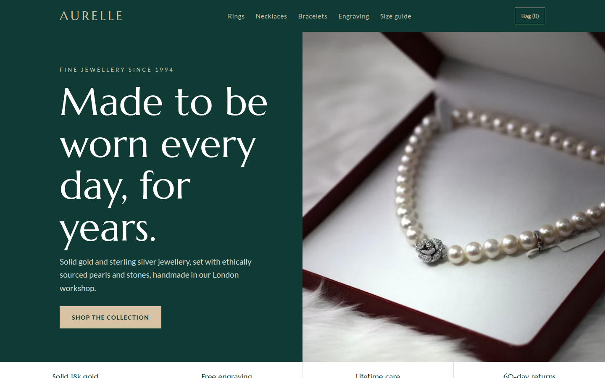](https://mmrahmanbappi.github.io/free-html-templates/ecommerce/jewellery-store/) | **[Aurelle](ecommerce/jewellery-store/)** Jewellery Store template  A refined fine-jewellery store in emerald and champagne. Filter by metal, add to bag, and try the live engraving preview: type a message and pick a metal to see it on the ring.  [Live demo and download](https://mmrahmanbappi.github.io/free-html-templates/ecommerce/jewellery-store/) |
| [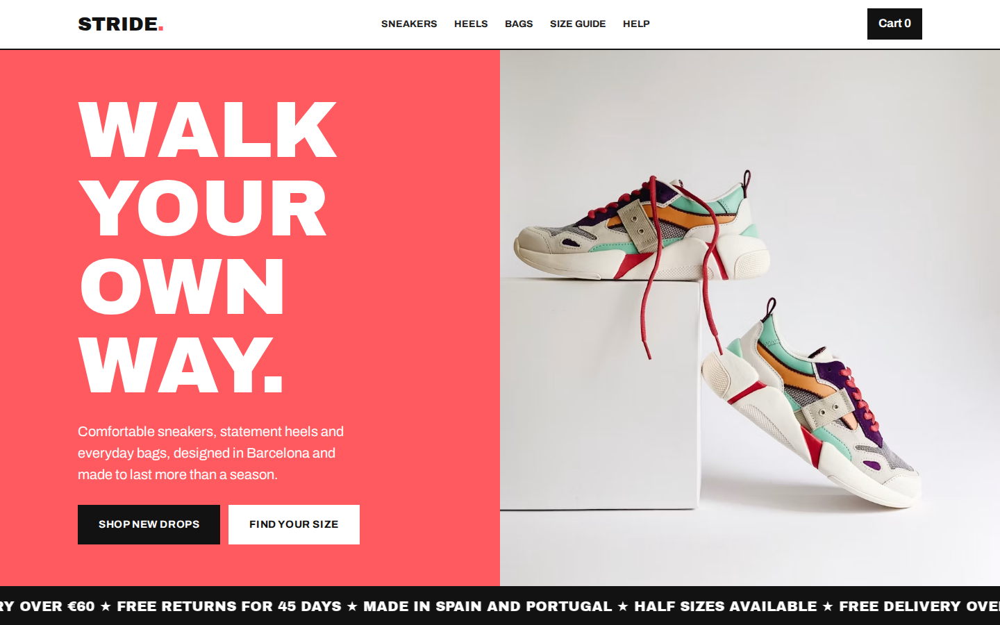](https://mmrahmanbappi.github.io/free-html-templates/ecommerce/shoes-bags-store/) | **[Stride](ecommerce/shoes-bags-store/)** Shoes and Bags Store template  A bold, sporty shoe and bag shop. Filter shoes or bags, pick an EU size on each product (sold-out sizes are crossed out) before adding to cart, with a full size conversion chart.  [Live demo and download](https://mmrahmanbappi.github.io/free-html-templates/ecommerce/shoes-bags-store/) |
| [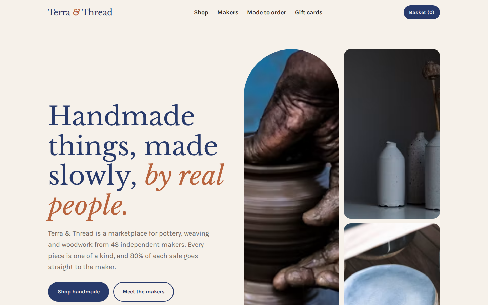](https://mmrahmanbappi.github.io/free-html-templates/ecommerce/handicraft-store/) | **[Terra & Thread](ecommerce/handicraft-store/)** Handicraft Store template  A warm marketplace for handmade pottery, weaving and woodwork. Filter by craft, meet the makers, see how made-to-order works and build a gift card with a live preview.  [Live demo and download](https://mmrahmanbappi.github.io/free-html-templates/ecommerce/handicraft-store/) |
| [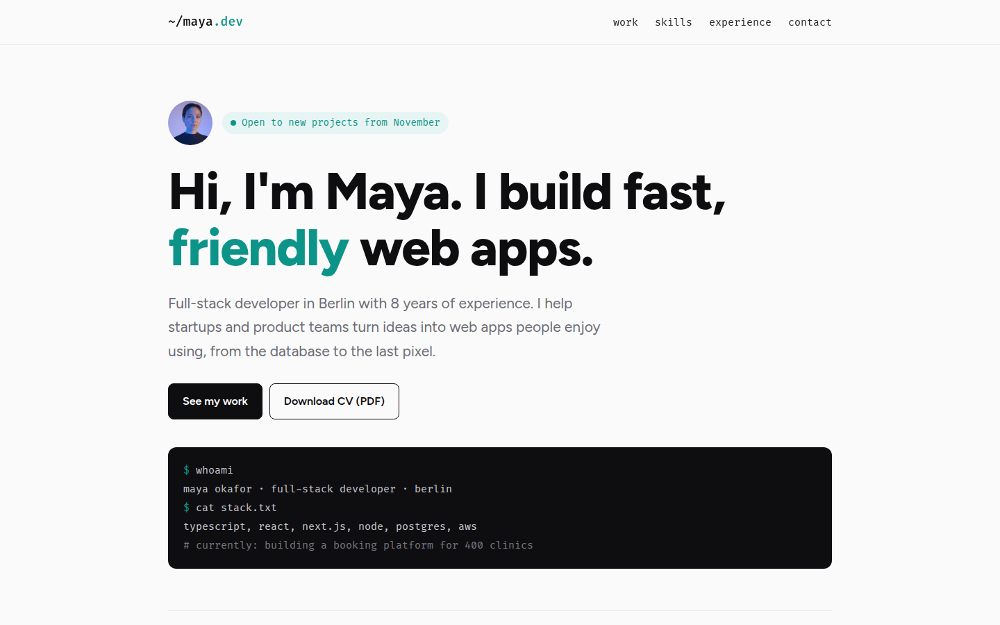](https://mmrahmanbappi.github.io/free-html-templates/portfolio/developer-portfolio/) | **[Maya Okafor](portfolio/developer-portfolio/)** Developer Portfolio template  A clean developer portfolio with a terminal-style intro. Projects can be filtered by technology, a GitHub-style activity chart shows a year of work, plus skills with years, work history and a copy email button.  [Live demo and download](https://mmrahmanbappi.github.io/free-html-templates/portfolio/developer-portfolio/) |
| [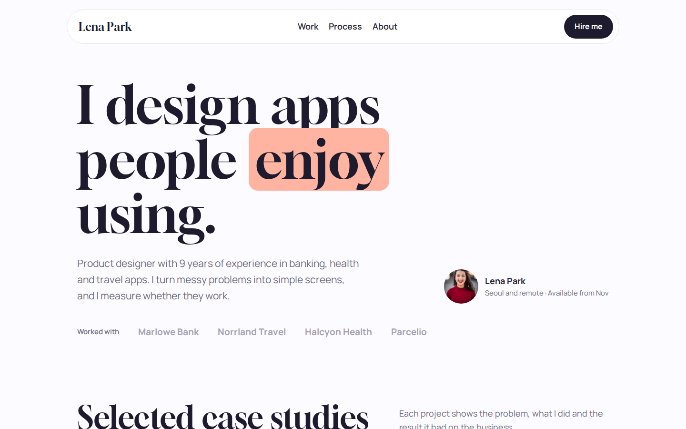](https://mmrahmanbappi.github.io/free-html-templates/portfolio/designer-portfolio/) | **[Lena Park](portfolio/designer-portfolio/)** Designer Portfolio template  A bright, friendly portfolio for a UX, UI or product designer. Colourful case study cards show the problem and the result, with a 4-step process, tools, a client quote and a contact form with tick-box options.  [Live demo and download](https://mmrahmanbappi.github.io/free-html-templates/portfolio/designer-portfolio/) |
| [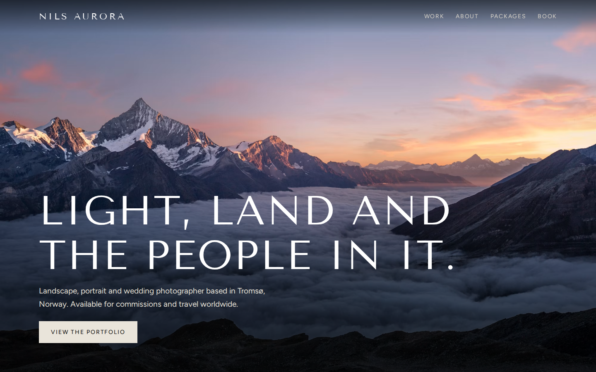](https://mmrahmanbappi.github.io/free-html-templates/portfolio/photographer-portfolio/) | **[Nils Aurora](portfolio/photographer-portfolio/)** Photographer Portfolio template  A dark, full-screen photography portfolio. The masonry gallery can be filtered and opens a full-screen lightbox with next and previous buttons and keyboard arrows, plus packages and a booking form.  [Live demo and download](https://mmrahmanbappi.github.io/free-html-templates/portfolio/photographer-portfolio/) |
| [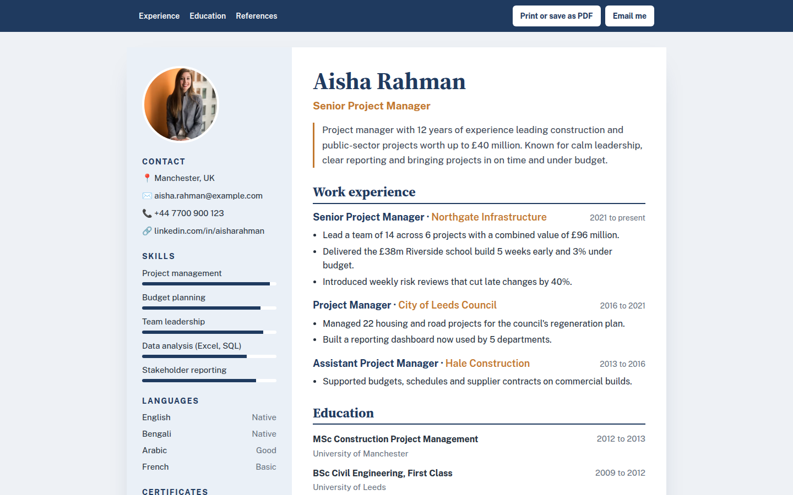](https://mmrahmanbappi.github.io/free-html-templates/portfolio/resume-cv/) | **[Aisha Rahman](portfolio/resume-cv/)** Resume and CV template  A tidy online CV that looks right on screen and on paper. One click prints it or saves it as a PDF, with the menu hidden. Includes skills bars, languages, certificates, work history, education and references.  [Live demo and download](https://mmrahmanbappi.github.io/free-html-templates/portfolio/resume-cv/) |
| [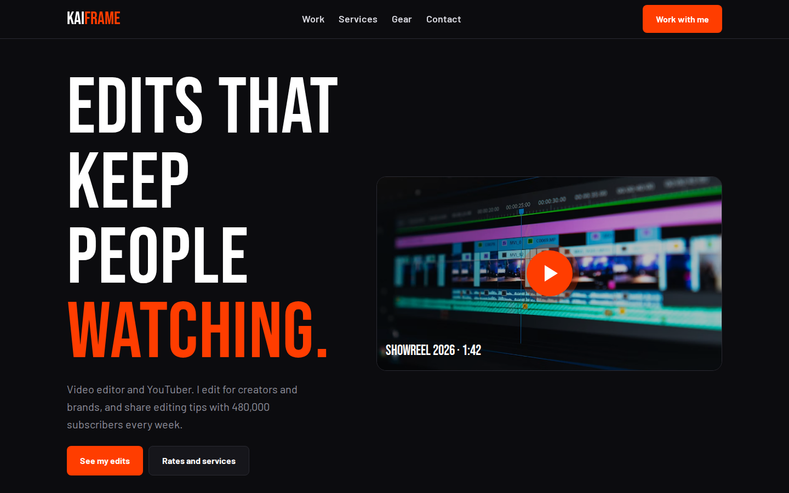](https://mmrahmanbappi.github.io/free-html-templates/portfolio/video-editor-youtuber/) | **[Kai Frame](portfolio/video-editor-youtuber/)** Video Editor Portfolio template  A dark, punchy site for a video editor, YouTuber or content creator. It has a showreel, channel stats, a filterable video grid that opens a player pop-up for your embed, services with prices and gear.  [Live demo and download](https://mmrahmanbappi.github.io/free-html-templates/portfolio/video-editor-youtuber/) |
| [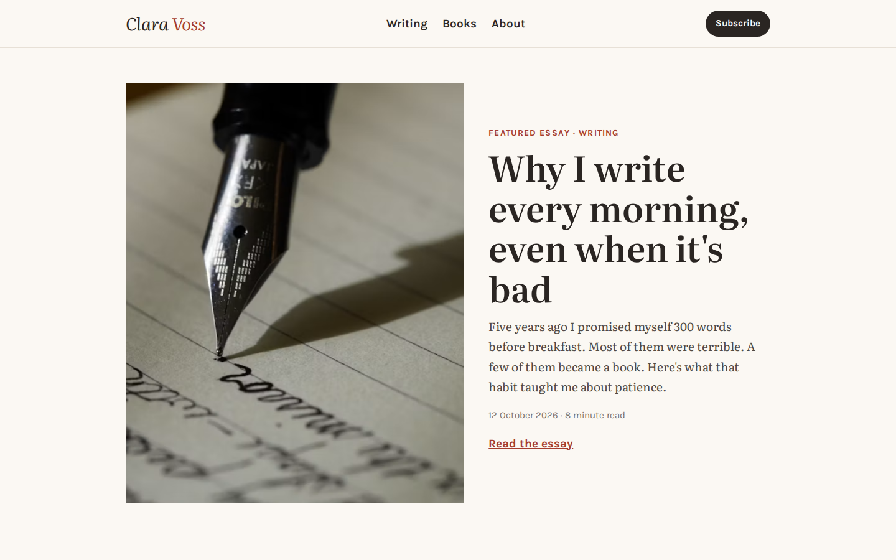](https://mmrahmanbappi.github.io/free-html-templates/portfolio/writer-blogger/) | **[Clara Voss](portfolio/writer-blogger/)** Writer and Blogger template  A calm, readable blog and writer site. It has a featured story, an article list with working search and topic filters, a newsletter box, an author bio and a books section.  [Live demo and download](https://mmrahmanbappi.github.io/free-html-templates/portfolio/writer-blogger/) |
| [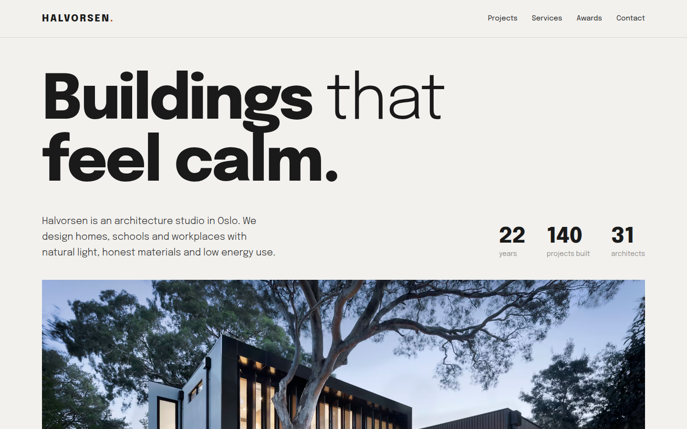](https://mmrahmanbappi.github.io/free-html-templates/portfolio/architect-portfolio/) | **[Halvorsen](portfolio/architect-portfolio/)** Architect Portfolio template  A calm, minimal site for an architect or architecture studio. The project list can be filtered and shows a large photo preview when you hover a project, with studio numbers, services and awards.  [Live demo and download](https://mmrahmanbappi.github.io/free-html-templates/portfolio/architect-portfolio/) |
| [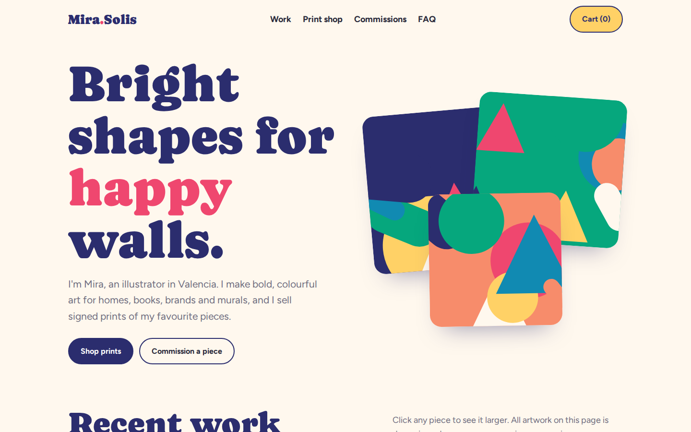](https://mmrahmanbappi.github.io/free-html-templates/portfolio/artist-illustrator/) | **[Mira Solis](portfolio/artist-illustrator/)** Artist Portfolio template  A bright, playful portfolio for an artist or illustrator. The artwork gallery opens a viewer, prints can be bought in three sizes with live prices, and the commission form shows a starting price.  [Live demo and download](https://mmrahmanbappi.github.io/free-html-templates/portfolio/artist-illustrator/) |
| [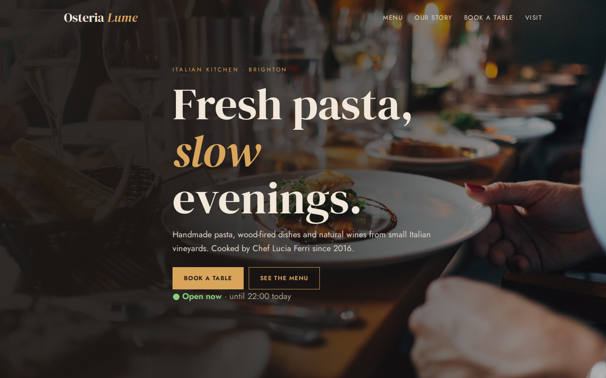](https://mmrahmanbappi.github.io/free-html-templates/restaurant/restaurant/) | **[Osteria Lume](restaurant/restaurant/)** Restaurant template  A warm, candlelit restaurant site. The menu has section tabs and vegetarian and gluten-free filters, the hero shows if you're open right now, and the booking form has time slots with fully booked times crossed out.  [Live demo and download](https://mmrahmanbappi.github.io/free-html-templates/restaurant/restaurant/) |
| [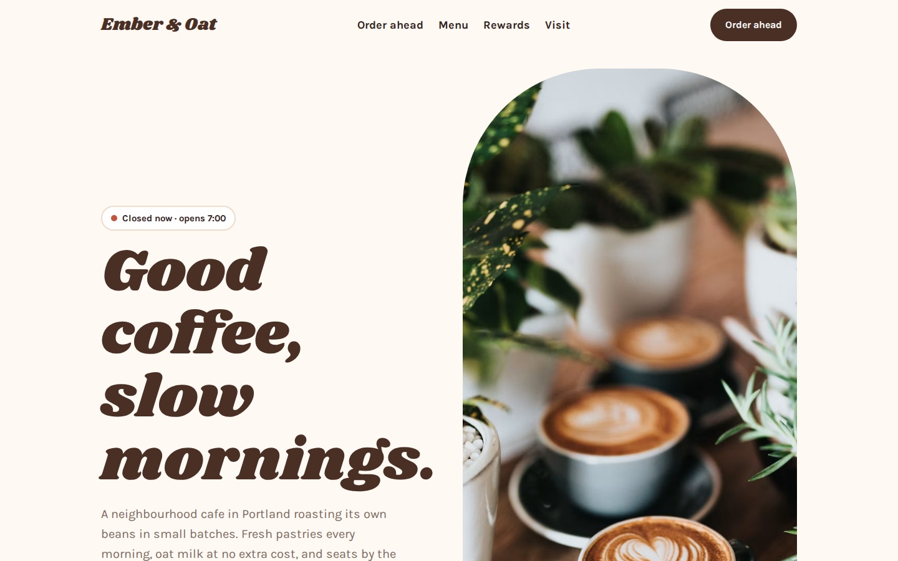](https://mmrahmanbappi.github.io/free-html-templates/restaurant/cafe-coffee-shop/) | **[Ember & Oat](restaurant/cafe-coffee-shop/)** Cafe and Coffee Shop template  A cosy neighbourhood cafe site. Build a drink by choosing type, size, milk and extras, and the cup and price update live. It also has a menu, a tappable loyalty stamp card and live open now hours.  [Live demo and download](https://mmrahmanbappi.github.io/free-html-templates/restaurant/cafe-coffee-shop/) |
| [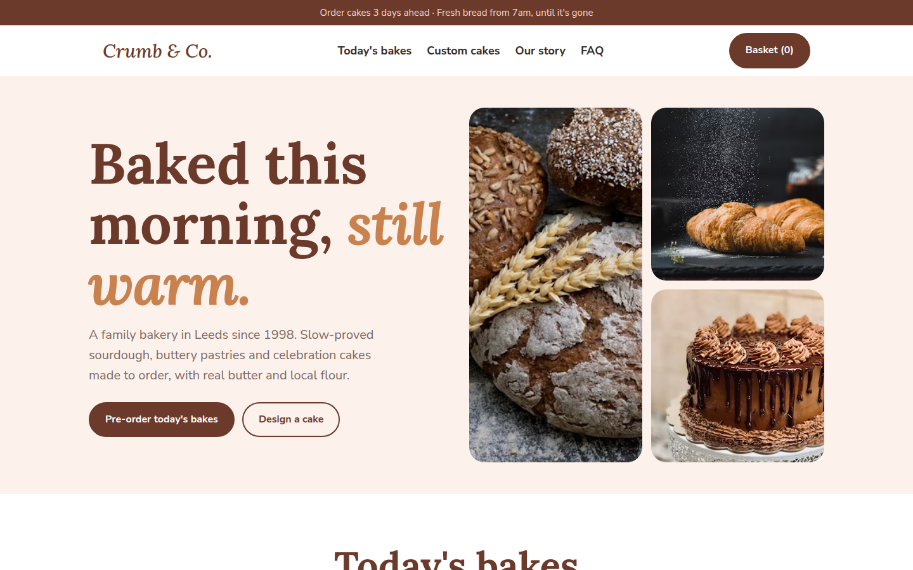](https://mmrahmanbappi.github.io/free-html-templates/restaurant/bakery/) | **[Crumb & Co](restaurant/bakery/)** Bakery template  A sweet family bakery site. Today's bakes show stock left and sold-out labels, and the cake builder draws your cake as you pick size, flavour, icing and a message, with the price updating live.  [Live demo and download](https://mmrahmanbappi.github.io/free-html-templates/restaurant/bakery/) |
| [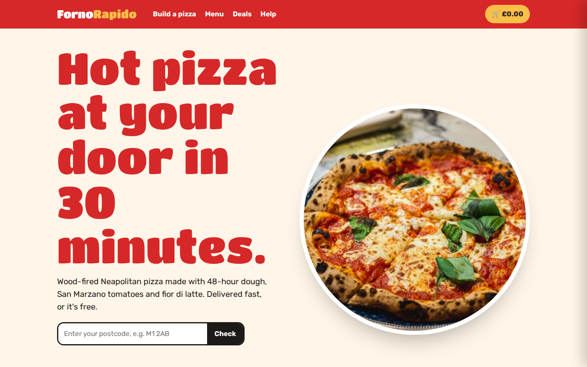](https://mmrahmanbappi.github.io/free-html-templates/restaurant/pizza-delivery/) | **[Forno Rapido](restaurant/pizza-delivery/)** Pizza Delivery template  A loud, hungry pizza delivery site. Build your own pizza and watch toppings appear on it, add menu pizzas to your order, and check the delivery time for your postcode.  [Live demo and download](https://mmrahmanbappi.github.io/free-html-templates/restaurant/pizza-delivery/) |
| [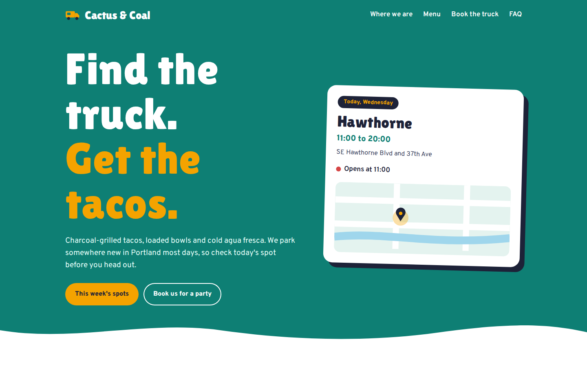](https://mmrahmanbappi.github.io/free-html-templates/restaurant/food-truck/) | **[Cactus & Coal](restaurant/food-truck/)** Food Truck template  A bright taco truck site. The hero shows where the truck is parked today and if it's serving right now, the week strip shows every stop, and the event form works out a price as you type.  [Live demo and download](https://mmrahmanbappi.github.io/free-html-templates/restaurant/food-truck/) |
| [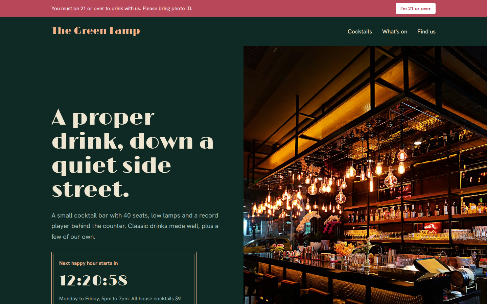](https://mmrahmanbappi.github.io/free-html-templates/restaurant/bar-lounge/) | **[The Green Lamp](restaurant/bar-lounge/)** Bar and Lounge template  A dark, art deco cocktail bar. The cocktail list filters by spirit and strength, a live clock counts down to happy hour, and the events calendar lets guests save a seat.  [Live demo and download](https://mmrahmanbappi.github.io/free-html-templates/restaurant/bar-lounge/) |
| [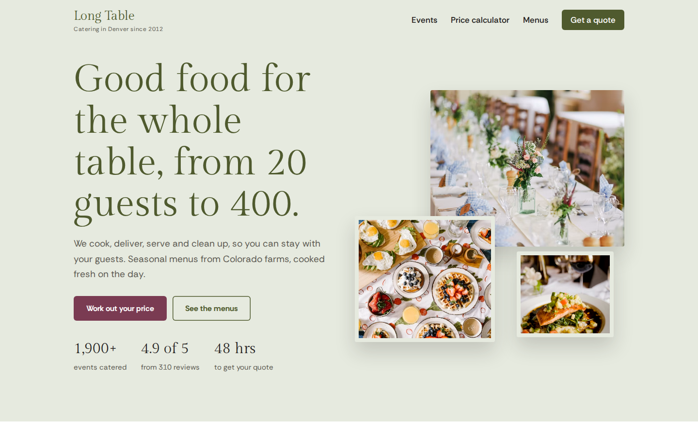](https://mmrahmanbappi.github.io/free-html-templates/restaurant/catering/) | **[Long Table Catering](restaurant/catering/)** Catering template  A calm catering site in olive and fig. Pick a package, drag the guest slider and tick extras, and the price updates line by line, then drops straight into the quote form.  [Live demo and download](https://mmrahmanbappi.github.io/free-html-templates/restaurant/catering/) |
| [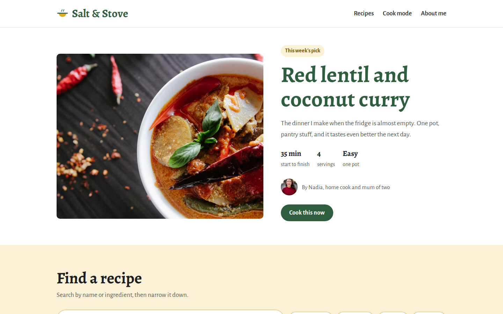](https://mmrahmanbappi.github.io/free-html-templates/restaurant/recipe-blog/) | **[Salt & Stove](restaurant/recipe-blog/)** Recipe Blog template  A friendly home cook's recipe blog. Search and filter recipes, open one in cook mode, change the servings and watch every amount update, then tick off steps as you cook.  [Live demo and download](https://mmrahmanbappi.github.io/free-html-templates/restaurant/recipe-blog/) |
| [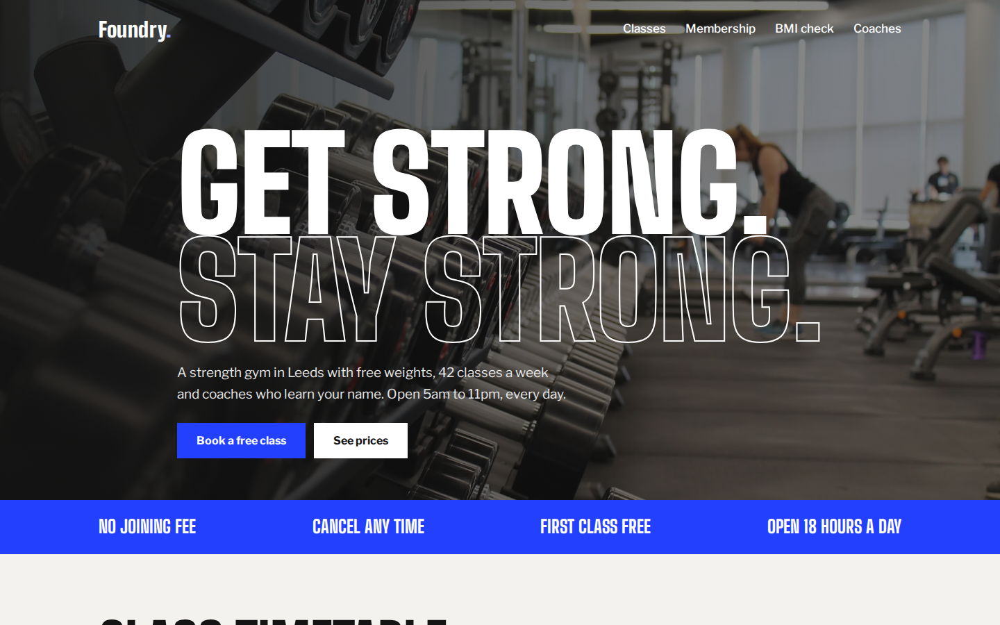](https://mmrahmanbappi.github.io/free-html-templates/health-fitness/gym-fitness/) | **[Foundry Strength Club](health-fitness/gym-fitness/)** Gym and Fitness template  A loud strength gym site in cobalt and chalk. Switch days on the class timetable and book a spot, flip membership prices to yearly, and check your BMI on a live scale.  [Live demo and download](https://mmrahmanbappi.github.io/free-html-templates/health-fitness/gym-fitness/) |
| [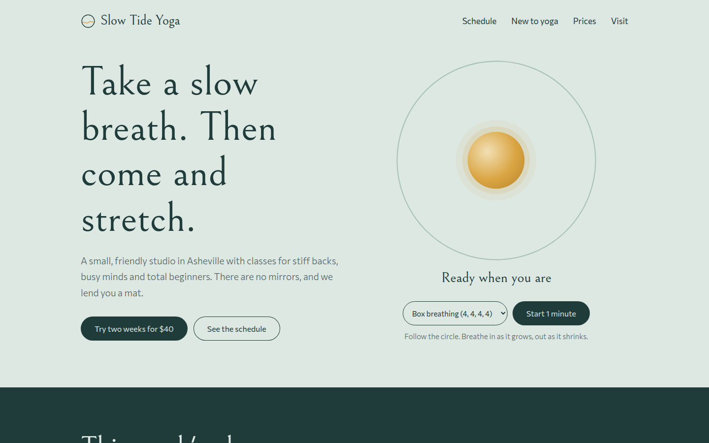](https://mmrahmanbappi.github.io/free-html-templates/health-fitness/yoga-studio/) | **[Slow Tide Yoga](health-fitness/yoga-studio/)** Yoga Studio template  A soft sea-glass yoga studio. The hero is a one-minute guided breathing timer, the weekly schedule filters by level, and a four-week path helps total beginners start.  [Live demo and download](https://mmrahmanbappi.github.io/free-html-templates/health-fitness/yoga-studio/) |
| [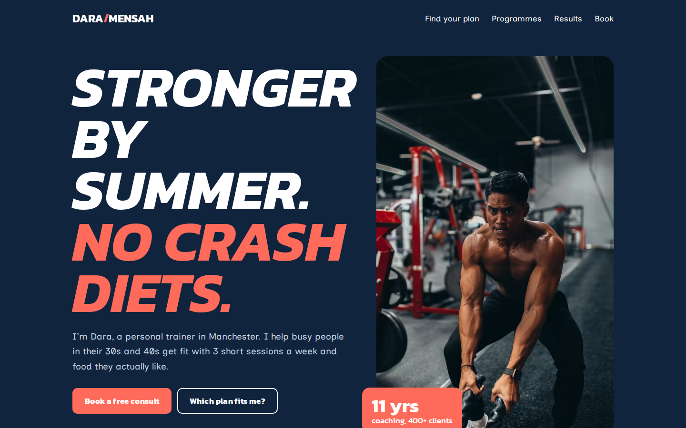](https://mmrahmanbappi.github.io/free-html-templates/health-fitness/personal-trainer/) | **[Dara Mensah](health-fitness/personal-trainer/)** Personal Trainer template  A bold personal trainer site in navy and coral. A three-question quiz picks the right programme, client stories flip between week 1 and final week numbers, and booking has time slots.  [Live demo and download](https://mmrahmanbappi.github.io/free-html-templates/health-fitness/personal-trainer/) |
| [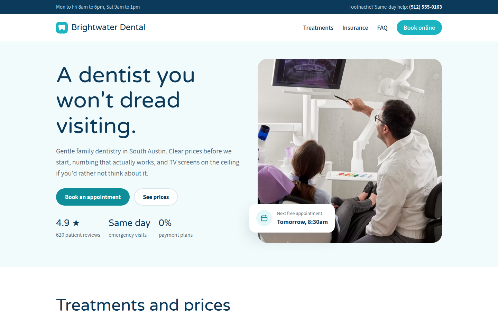](https://mmrahmanbappi.github.io/free-html-templates/health-fitness/dental-clinic/) | **[Brightwater Dental](health-fitness/dental-clinic/)** Dental Clinic template  A fresh, friendly dental practice. Treatments show clear prices by type, patients pick a day and time for their visit, and the insurance checker explains what their plan usually covers.  [Live demo and download](https://mmrahmanbappi.github.io/free-html-templates/health-fitness/dental-clinic/) |
| [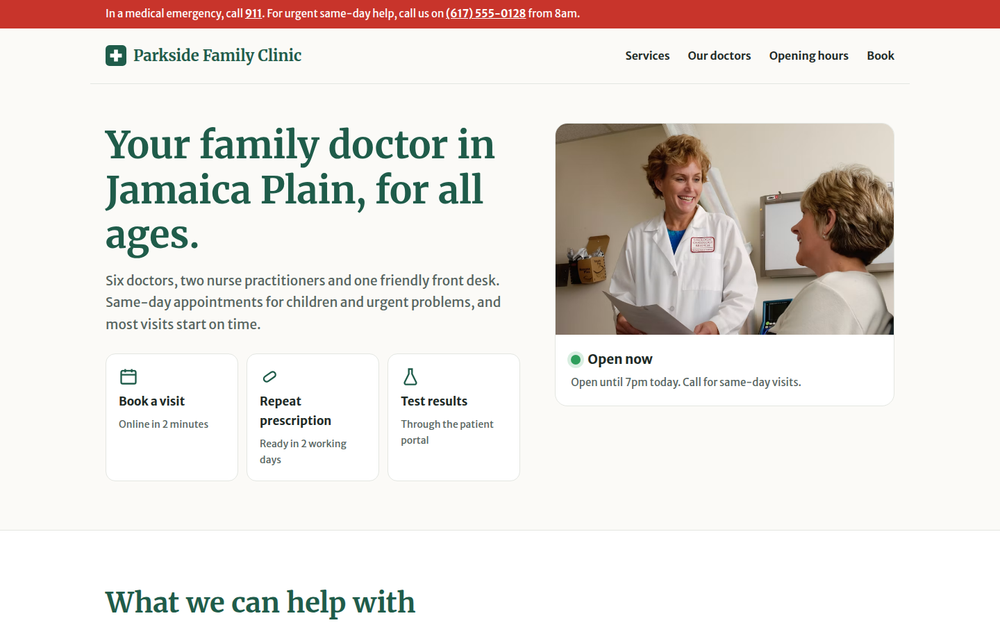](https://mmrahmanbappi.github.io/free-html-templates/health-fitness/medical-clinic/) | **[Parkside Family Clinic](health-fitness/medical-clinic/)** Medical Clinic template  A calm family doctor's clinic. It shows if the clinic is open right now and when it opens next, doctors filter by specialty, and each doctor card fills in the booking form.  [Live demo and download](https://mmrahmanbappi.github.io/free-html-templates/health-fitness/medical-clinic/) |
| [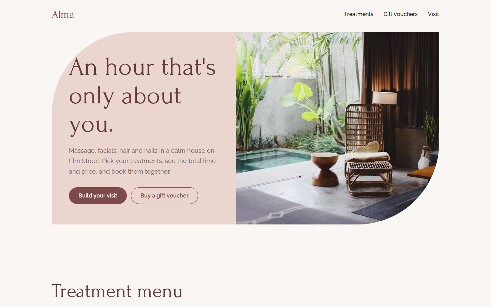](https://mmrahmanbappi.github.io/free-html-templates/health-fitness/spa-salon/) | **[Alma Spa](health-fitness/spa-salon/)** Spa and Salon template  A warm rosewood spa and salon. Add massages, facials, hair and nails to one visit and see the total time and price, then design a gift voucher and watch the card update.  [Live demo and download](https://mmrahmanbappi.github.io/free-html-templates/health-fitness/spa-salon/) |
| [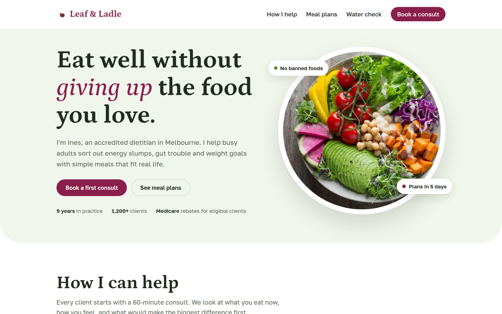](https://mmrahmanbappi.github.io/free-html-templates/health-fitness/nutritionist/) | **[Leaf & Ladle](health-fitness/nutritionist/)** Nutritionist template  A fresh, friendly dietitian site in beet and leaf green. Meal plan prices change as you pick 4, 8 or 12 weeks, and the water calculator fills up glasses as you type.  [Live demo and download](https://mmrahmanbappi.github.io/free-html-templates/health-fitness/nutritionist/) |
| [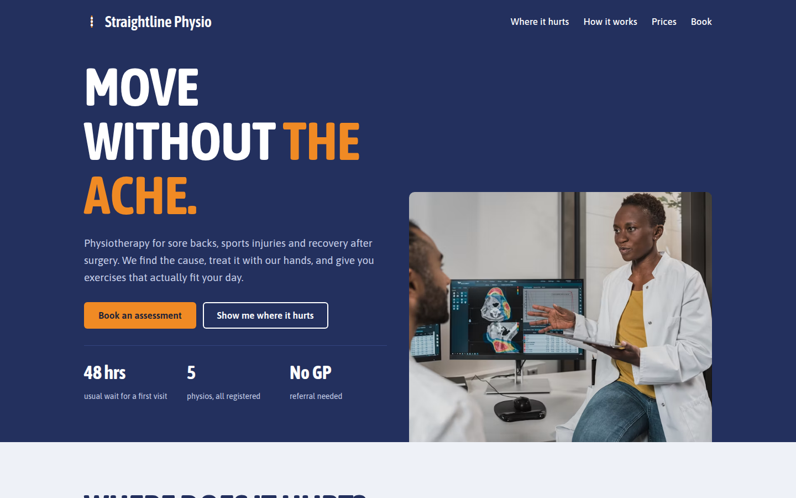](https://mmrahmanbappi.github.io/free-html-templates/health-fitness/physiotherapy/) | **[Straightline Physio](health-fitness/physiotherapy/)** Physiotherapy template  A bold physio clinic in indigo and orange. Tap a spot on the body map to see common problems, usual sessions and recovery time, then book for that area.  [Live demo and download](https://mmrahmanbappi.github.io/free-html-templates/health-fitness/physiotherapy/) |
| [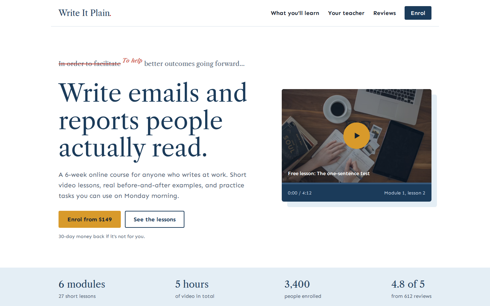](https://mmrahmanbappi.github.io/free-html-templates/education/online-course/) | **[Write It Plain](education/online-course/)** Online Course template  A course sales page styled like an editor's desk, with red pen edits in the hero. The curriculum opens module by module, the preview lesson plays, and team seat prices update.  [Live demo and download](https://mmrahmanbappi.github.io/free-html-templates/education/online-course/) |
| [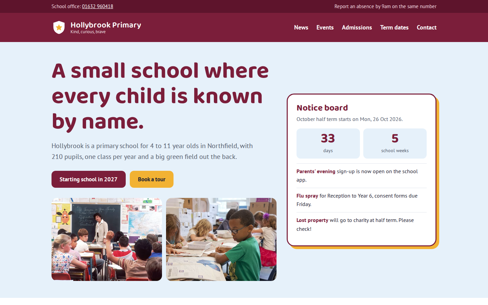](https://mmrahmanbappi.github.io/free-html-templates/education/school/) | **[Hollybrook Primary](education/school/)** School template  A warm primary school site in maroon and gold. The notice board counts down to the next holiday, news filters by topic, and the term dates table highlights the next break.  [Live demo and download](https://mmrahmanbappi.github.io/free-html-templates/education/school/) |
| [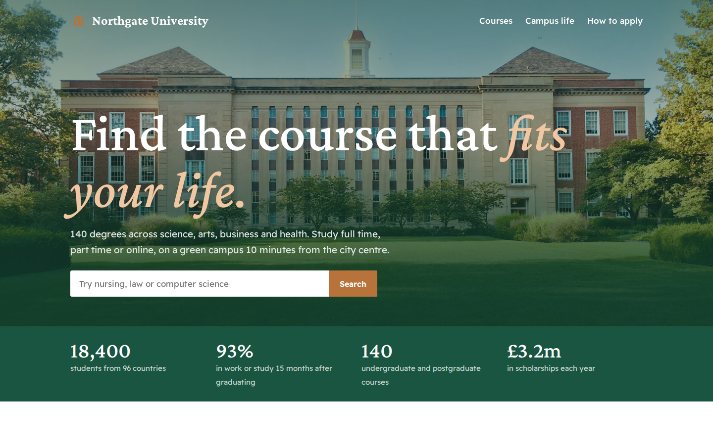](https://mmrahmanbappi.github.io/free-html-templates/education/university/) | **[Northgate University](education/university/)** University template  A classic university site in deep green and copper. Search from the hero, then filter courses by level, subject and study mode and add them to a shortlist.  [Live demo and download](https://mmrahmanbappi.github.io/free-html-templates/education/university/) |
| [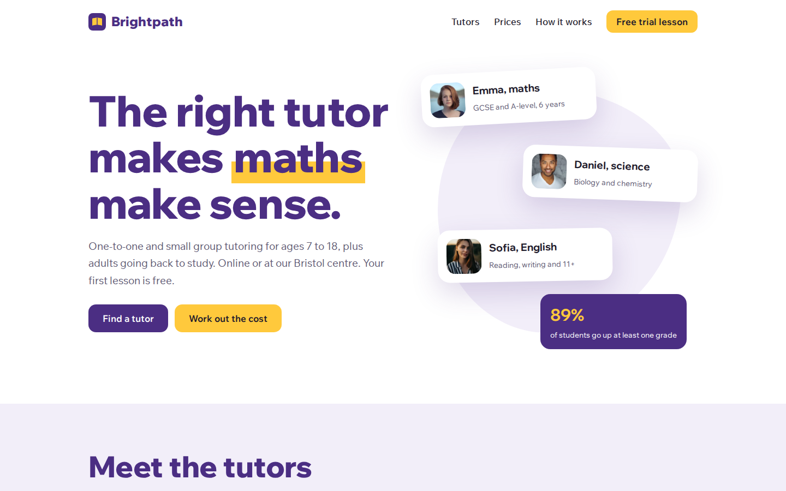](https://mmrahmanbappi.github.io/free-html-templates/education/tutoring/) | **[Brightpath Tutors](education/tutoring/)** Tutoring template  A cheerful tutoring site in purple and sunflower. Filter tutors by subject, work out the monthly cost with the price calculator, and book a free trial with any tutor.  [Live demo and download](https://mmrahmanbappi.github.io/free-html-templates/education/tutoring/) |
| [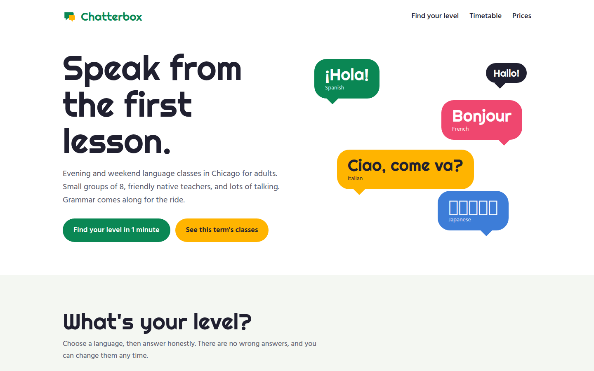](https://mmrahmanbappi.github.io/free-html-templates/education/language-school/) | **[Chatterbox](education/language-school/)** Language School template  A colourful language school with speech bubbles in the hero. Pick a language, answer six quick questions to find your level, then filter the timetable and hold a seat.  [Live demo and download](https://mmrahmanbappi.github.io/free-html-templates/education/language-school/) |
| [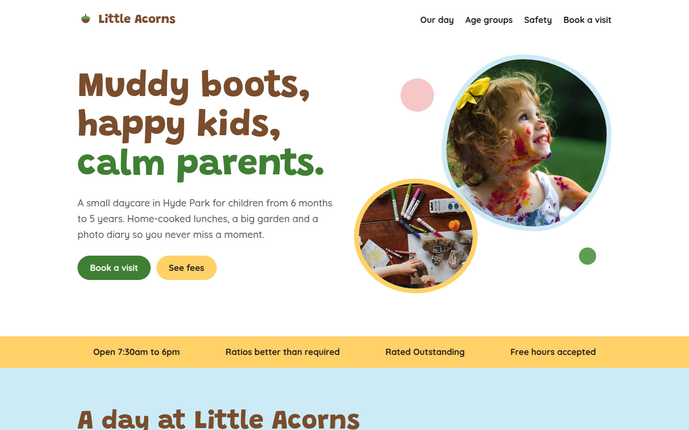](https://mmrahmanbappi.github.io/free-html-templates/education/kids-daycare/) | **[Little Acorns](education/kids-daycare/)** Kids Daycare template  A soft, playful daycare site in acorn brown, leaf green and sunshine. The daily routine highlights what's happening right now, and each age group shows ratios and fees.  [Live demo and download](https://mmrahmanbappi.github.io/free-html-templates/education/kids-daycare/) |
| [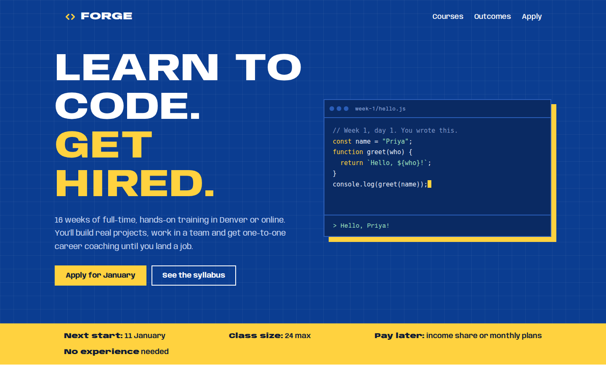](https://mmrahmanbappi.github.io/free-html-templates/education/coding-bootcamp/) | **[Forge Code School](education/coding-bootcamp/)** Coding Bootcamp template  A blueprint-style coding school. Code types itself in the hero, each track has a week by week syllabus, outcomes show as a bar chart, and the application has 3 steps.  [Live demo and download](https://mmrahmanbappi.github.io/free-html-templates/education/coding-bootcamp/) |
| [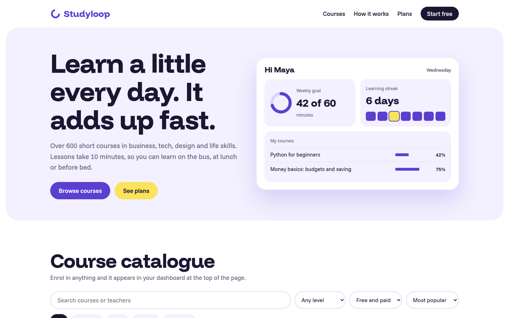](https://mmrahmanbappi.github.io/free-html-templates/education/elearning-platform/) | **[Studyloop](education/elearning-platform/)** E-learning Platform template  A bright e-learning platform in grape and lemon. Search, filter and sort the course catalogue, and every course you enrol in shows up in the learner dashboard in the hero.  [Live demo and download](https://mmrahmanbappi.github.io/free-html-templates/education/elearning-platform/) |
| [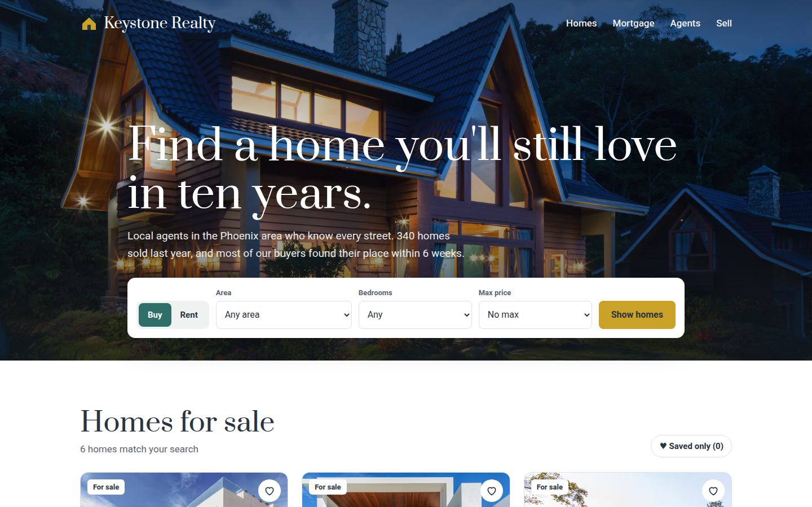](https://mmrahmanbappi.github.io/free-html-templates/real-estate-travel/real-estate-agency/) | **[Keystone Realty](real-estate-travel/real-estate-agency/)** Real Estate Agency template  A calm, trustworthy estate agency in teal and gold. Switch between buy and rent, filter homes by area, bedrooms and price, save favourites, and work out a monthly mortgage payment.  [Live demo and download](https://mmrahmanbappi.github.io/free-html-templates/real-estate-travel/real-estate-agency/) |
| [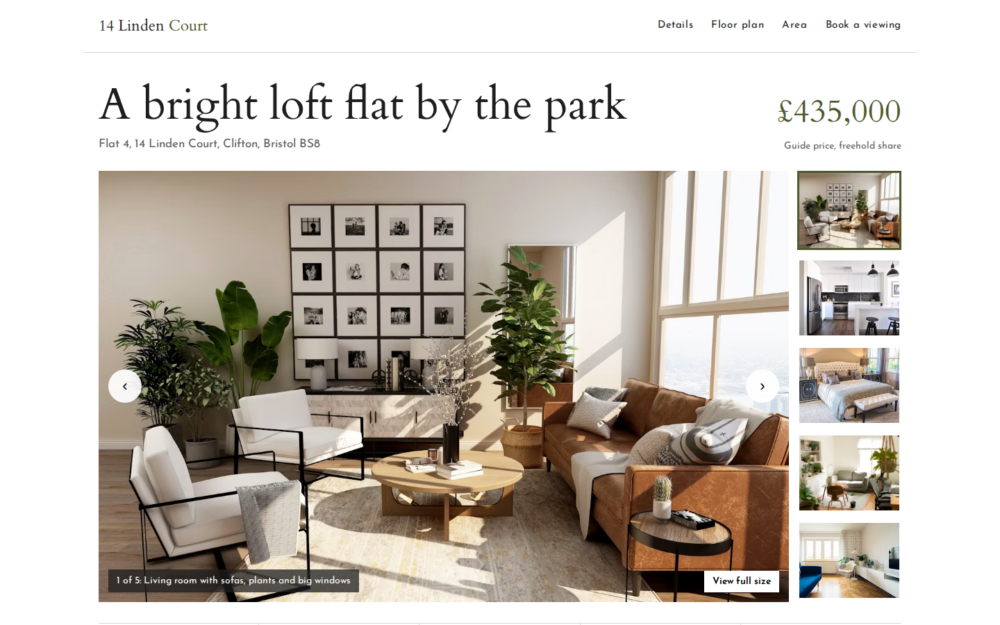](https://mmrahmanbappi.github.io/free-html-templates/real-estate-travel/property-listing/) | **[14 Linden Court](real-estate-travel/property-listing/)** Property Listing template  A quiet, editorial single property page. Flick through the photo gallery or open it full size, tap rooms on the floor plan to see sizes, and book a viewing time.  [Live demo and download](https://mmrahmanbappi.github.io/free-html-templates/real-estate-travel/property-listing/) |
| [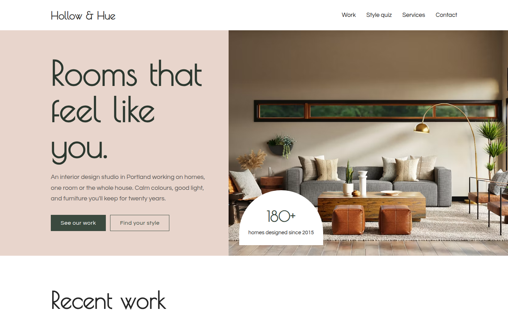](https://mmrahmanbappi.github.io/free-html-templates/real-estate-travel/interior-design/) | **[Hollow & Hue](real-estate-travel/interior-design/)** Interior Design template  A soft, grown-up interior design studio in moss and plaster pink. The portfolio filters by room, and a three-question style quiz shows your look with a matching palette.  [Live demo and download](https://mmrahmanbappi.github.io/free-html-templates/real-estate-travel/interior-design/) |
| [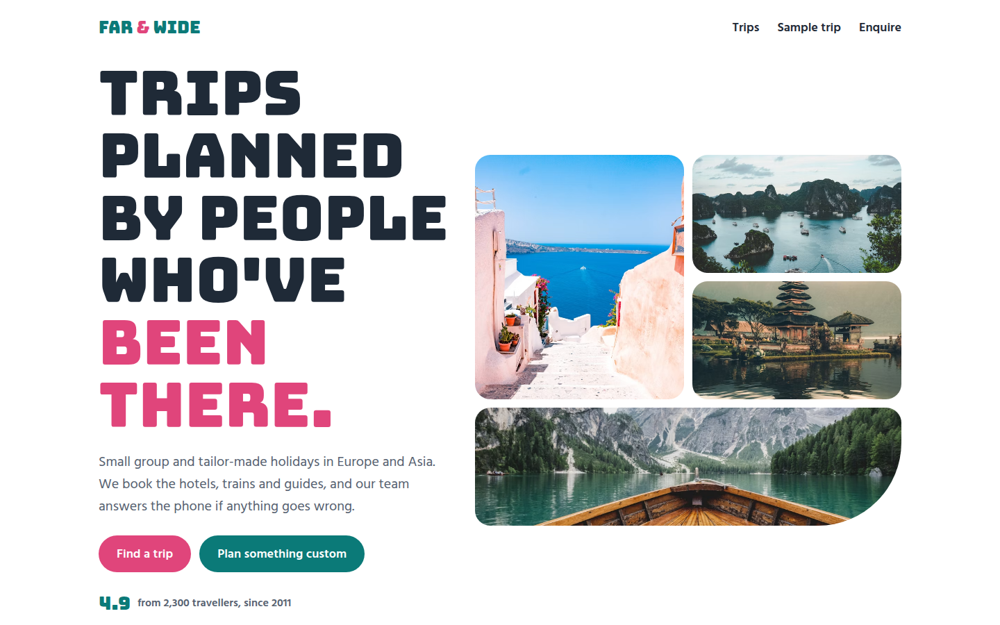](https://mmrahmanbappi.github.io/free-html-templates/real-estate-travel/travel-agency/) | **[Far & Wide Trips](real-estate-travel/travel-agency/)** Travel Agency template  A bright travel agency with a photo collage hero. Filter trips by region, length and budget, open a sample itinerary day by day, and see an estimated cost in the enquiry form.  [Live demo and download](https://mmrahmanbappi.github.io/free-html-templates/real-estate-travel/travel-agency/) |
| [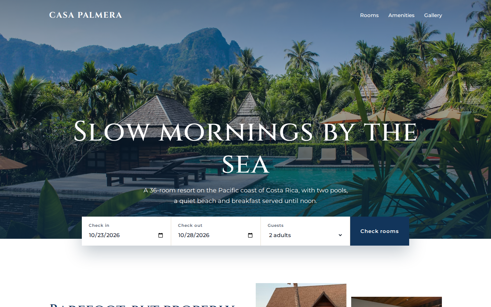](https://mmrahmanbappi.github.io/free-html-templates/real-estate-travel/hotel-resort/) | **[Casa Palmera](real-estate-travel/hotel-resort/)** Hotel and Resort template  A relaxed coastal resort in ocean blue and sand. Pick dates and guests in the hero, and every room shows the total for your stay, hides rooms too small for your group and builds a booking summary.  [Live demo and download](https://mmrahmanbappi.github.io/free-html-templates/real-estate-travel/hotel-resort/) |
| [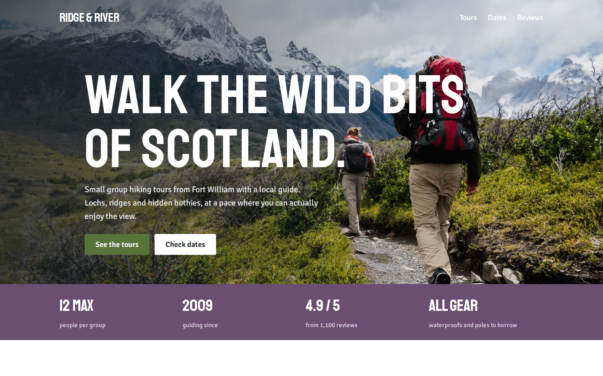](https://mmrahmanbappi.github.io/free-html-templates/real-estate-travel/tour-guide/) | **[Ridge & River Tours](real-estate-travel/tour-guide/)** Tour Guide template  A rugged hiking tour company in heather and moss. Filter tours by length, change the group size to see the price per person drop, and pick a date on a live month calendar.  [Live demo and download](https://mmrahmanbappi.github.io/free-html-templates/real-estate-travel/tour-guide/) |
| [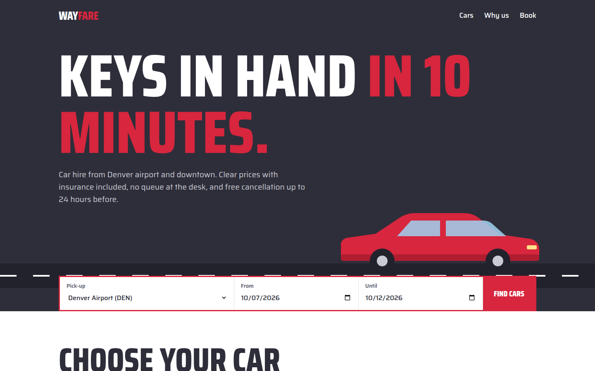](https://mmrahmanbappi.github.io/free-html-templates/real-estate-travel/car-rental/) | **[Wayfare Car Hire](real-estate-travel/car-rental/)** Car Rental template  A bold car hire site in red and graphite with a drawn car on the road. Filter cars by type, gearbox and seats, pick one, add extras, and the total updates for your dates.  [Live demo and download](https://mmrahmanbappi.github.io/free-html-templates/real-estate-travel/car-rental/) |
| [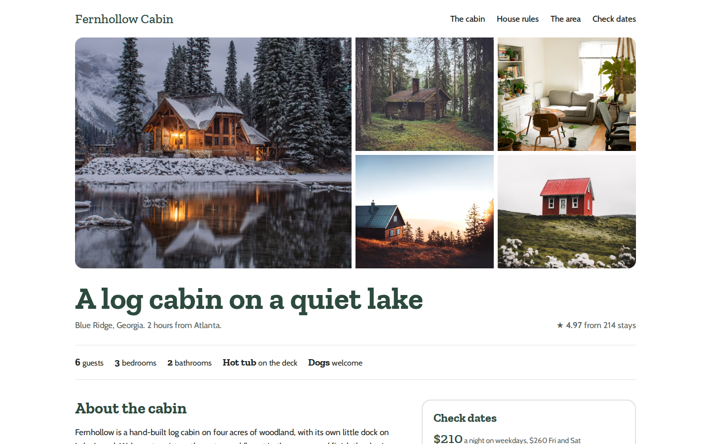](https://mmrahmanbappi.github.io/free-html-templates/real-estate-travel/vacation-rental/) | **[Fernhollow Cabin](real-estate-travel/vacation-rental/)** Vacation Rental template  A cosy single cabin page in pine and lake blue. Pick check-in and check-out on the availability calendar, booked nights are crossed out, and the price splits weeknights, weekends and fees.  [Live demo and download](https://mmrahmanbappi.github.io/free-html-templates/real-estate-travel/vacation-rental/) |
| [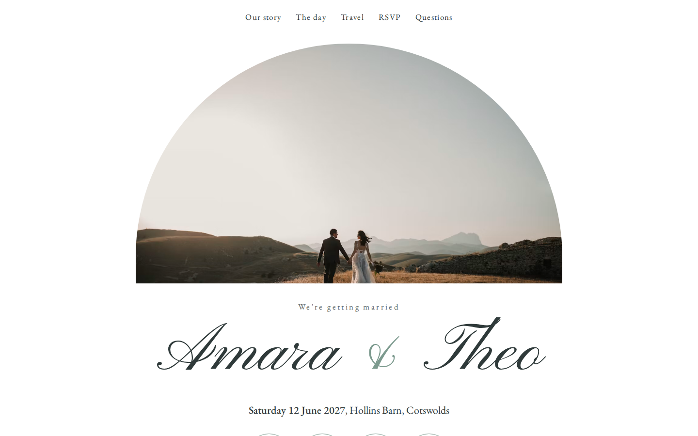](https://mmrahmanbappi.github.io/free-html-templates/events-community/wedding/) | **[Amara & Theo](events-community/wedding/)** Wedding template  A romantic wedding site in eucalyptus and blush with a script heading. It counts down to the big day, tells the couple's story, and the RSVP asks each guest for their meal.  [Live demo and download](https://mmrahmanbappi.github.io/free-html-templates/events-community/wedding/) |
| [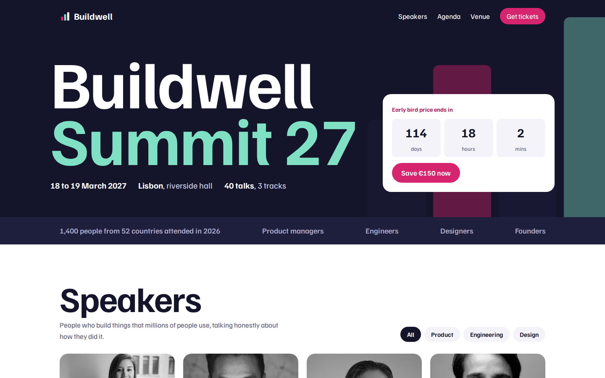](https://mmrahmanbappi.github.io/free-html-templates/events-community/conference-event/) | **[Buildwell Summit](events-community/conference-event/)** Conference template  A bold tech conference site in midnight, magenta and mint. Filter speakers by track, star talks to build your own schedule, and pick ticket quantities with a running total.  [Live demo and download](https://mmrahmanbappi.github.io/free-html-templates/events-community/conference-event/) |
| [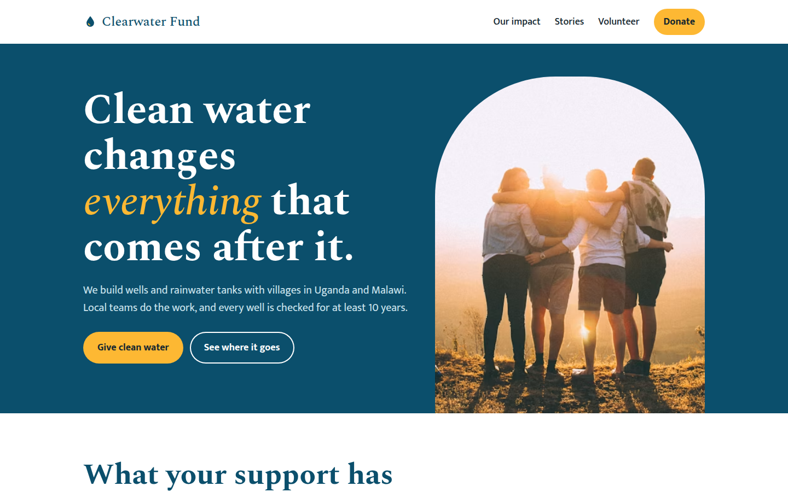](https://mmrahmanbappi.github.io/free-html-templates/events-community/nonprofit-charity/) | **[Clearwater Fund](events-community/nonprofit-charity/)** Nonprofit and Charity template  A hopeful clean water charity in deep blue and sunshine yellow. Pick a monthly or one-time amount and see exactly what it pays for, watch the appeal bar move, and sign up to volunteer.  [Live demo and download](https://mmrahmanbappi.github.io/free-html-templates/events-community/nonprofit-charity/) |
| [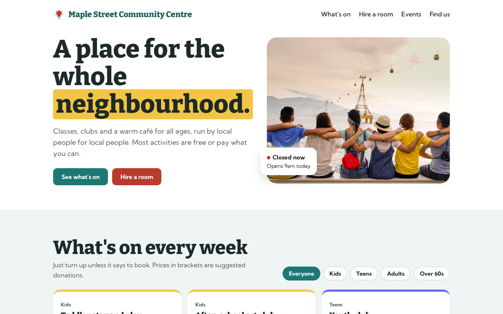](https://mmrahmanbappi.github.io/free-html-templates/events-community/community-center/) | **[Maple Street Community Centre](events-community/community-center/)** Community Center template  A friendly neighbourhood centre in teal, maple red and yellow. It shows if the centre is open now, filters weekly activities by age, prices room hire with a community discount and lists events by month.  [Live demo and download](https://mmrahmanbappi.github.io/free-html-templates/events-community/community-center/) |
| [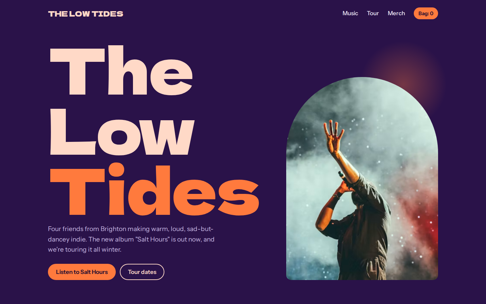](https://mmrahmanbappi.github.io/free-html-templates/events-community/musician-band/) | **[The Low Tides](events-community/musician-band/)** Band and Musician template  A loud indie band site in ultraviolet and sunset orange. The album player runs through the track list, tour dates filter by region with sold out shows marked, and merch goes into a bag.  [Live demo and download](https://mmrahmanbappi.github.io/free-html-templates/events-community/musician-band/) |
| [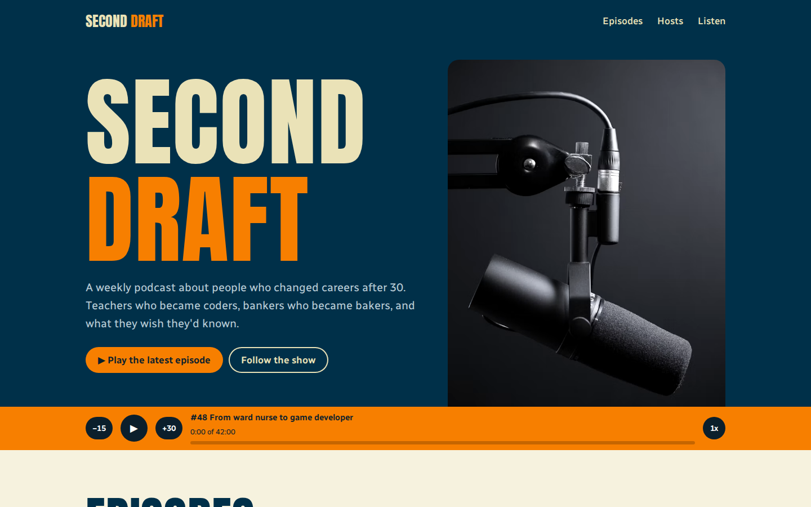](https://mmrahmanbappi.github.io/free-html-templates/events-community/podcast/) | **[Second Draft](events-community/podcast/)** Podcast template  A bold podcast site in navy, orange and sand. Search and filter episodes, play any of them in the sticky player with skip and speed buttons, meet the hosts and copy the RSS link.  [Live demo and download](https://mmrahmanbappi.github.io/free-html-templates/events-community/podcast/) |
| [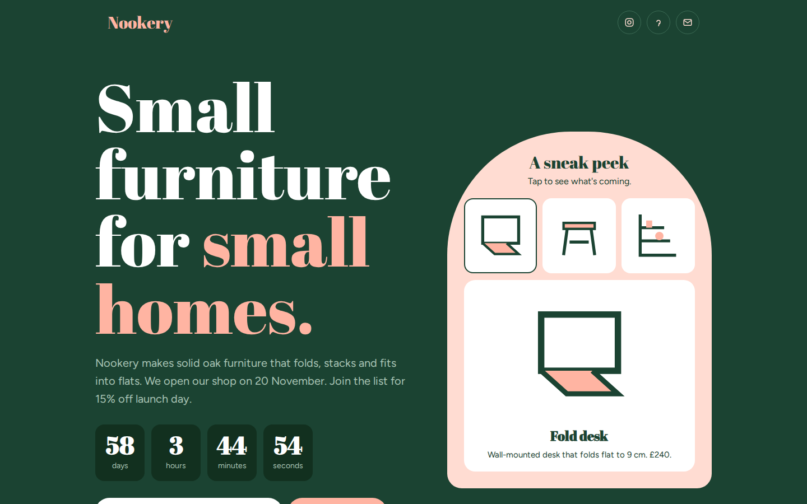](https://mmrahmanbappi.github.io/free-html-templates/landing-pages/coming-soon/) | **[Nookery](landing-pages/coming-soon/)** Coming Soon template  A warm coming soon page in forest green and peach. It counts down to launch, shows your place in the waitlist after you sign up, and lets visitors tap through a sneak peek of the products.  [Live demo and download](https://mmrahmanbappi.github.io/free-html-templates/landing-pages/coming-soon/) |
| [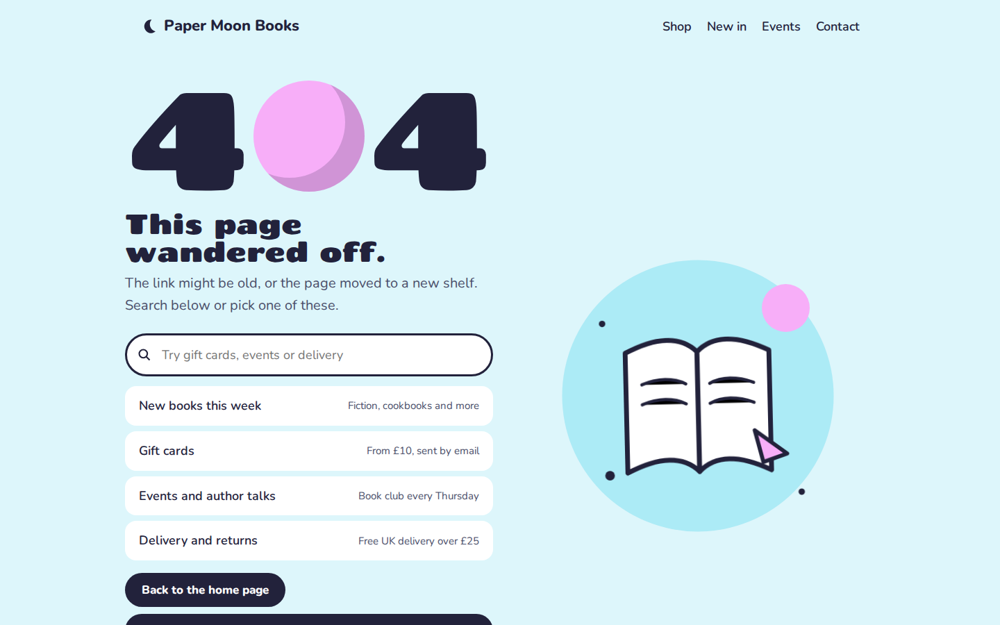](https://mmrahmanbappi.github.io/free-html-templates/landing-pages/error-404/) | **[Paper Moon Books](landing-pages/error-404/)** 404 Error Page template  A playful 404 page for a bookshop in sky blue and pink. A floating book illustration, a search box that filters helpful links as you type, and a random book suggestion.  [Live demo and download](https://mmrahmanbappi.github.io/free-html-templates/landing-pages/error-404/) |
| [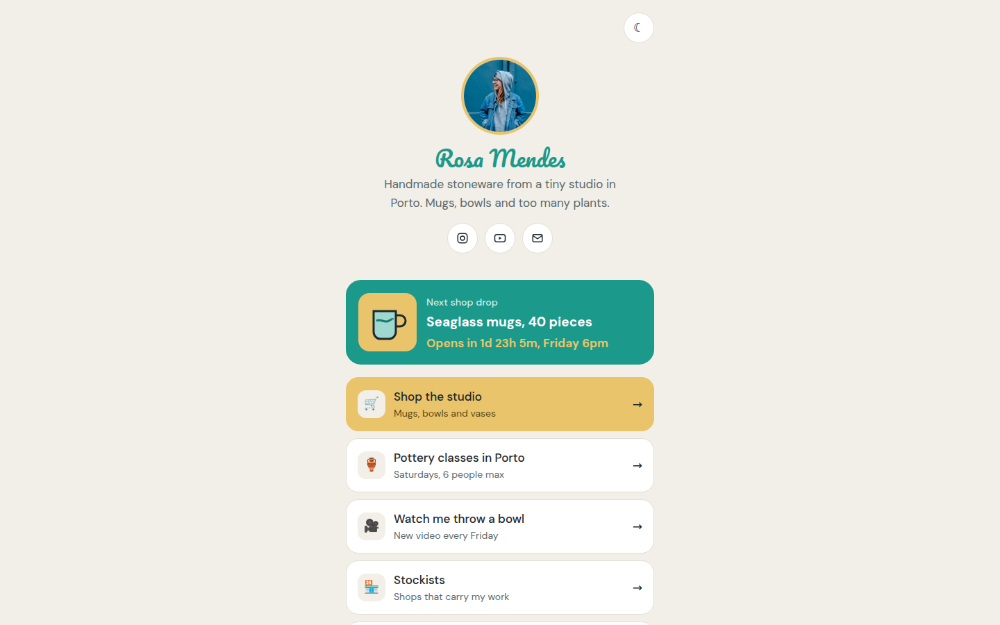](https://mmrahmanbappi.github.io/free-html-templates/landing-pages/link-in-bio/) | **[Rosa Mendes Ceramics](landing-pages/link-in-bio/)** Link in Bio template  A mobile-first link page for a ceramicist in glaze teal and mustard. Profile, link buttons, a countdown to the next shop drop, email signup, copy and share buttons, and a dark mode switch.  [Live demo and download](https://mmrahmanbappi.github.io/free-html-templates/landing-pages/link-in-bio/) |
| [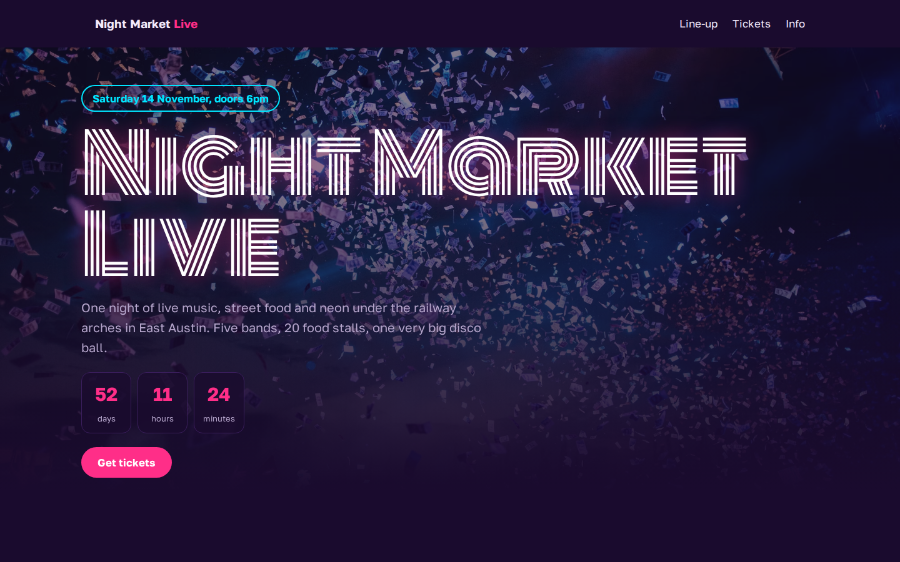](https://mmrahmanbappi.github.io/free-html-templates/landing-pages/event-ticket/) | **[Night Market Live](landing-pages/event-ticket/)** Event Ticket template  A neon single-night event page in deep purple, pink and cyan. Count down to doors, see the line-up, pick ticket quantities across tiers with limits, try a promo code and watch the total with fees.  [Live demo and download](https://mmrahmanbappi.github.io/free-html-templates/landing-pages/event-ticket/) |
| [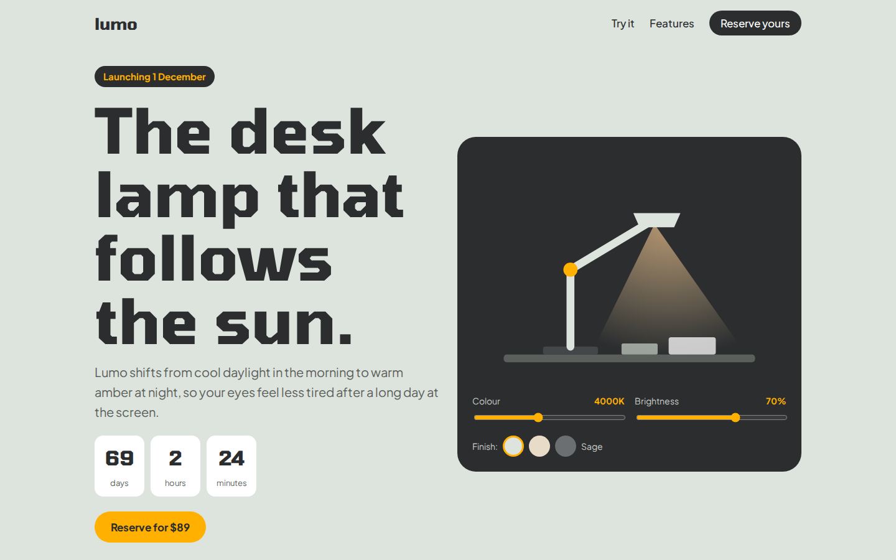](https://mmrahmanbappi.github.io/free-html-templates/landing-pages/product-launch/) | **[Lumo Desk Lamp](landing-pages/product-launch/)** Product Launch template  A calm hardware launch page in sage, graphite and amber. Drag the colour and brightness sliders to light up the drawn lamp, switch its finish, tap through features and reserve an early bird unit.  [Live demo and download](https://mmrahmanbappi.github.io/free-html-templates/landing-pages/product-launch/) |
| [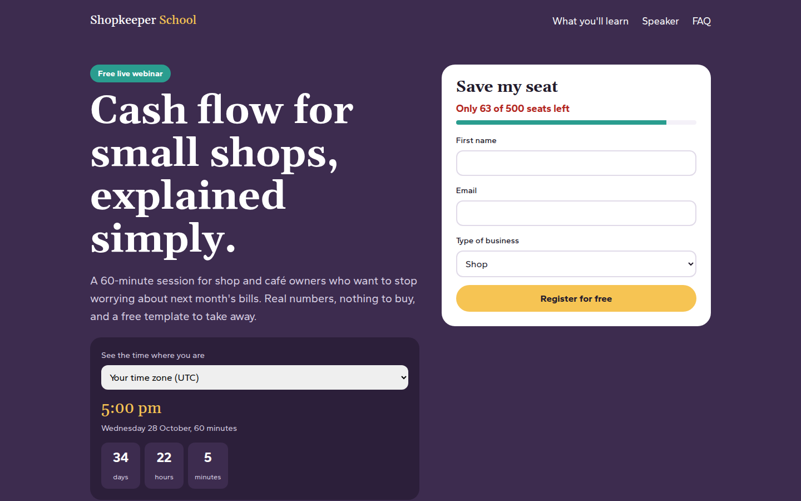](https://mmrahmanbappi.github.io/free-html-templates/landing-pages/webinar-signup/) | **[Cash Flow Class](landing-pages/webinar-signup/)** Webinar Signup template  A clear webinar signup page in plum, mint and yellow. Choose your city to see the start time where you are, watch seats run down as you register, and add the event to your calendar.  [Live demo and download](https://mmrahmanbappi.github.io/free-html-templates/landing-pages/webinar-signup/) |
| [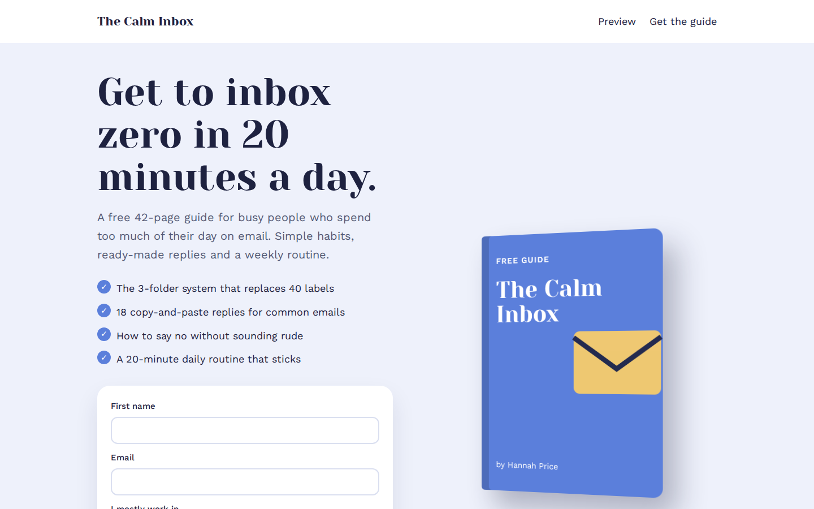](https://mmrahmanbappi.github.io/free-html-templates/landing-pages/ebook-download/) | **[The Calm Inbox](landing-pages/ebook-download/)** Ebook Download template  A calm lead magnet page in cornflower blue with a drawn 3D book cover. Tap through chapter previews, and the download form gives a real sample file after signup.  [Live demo and download](https://mmrahmanbappi.github.io/free-html-templates/landing-pages/ebook-download/) |
| [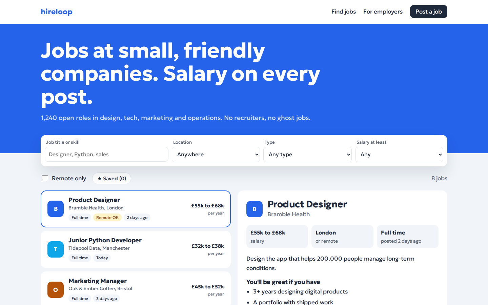](https://mmrahmanbappi.github.io/free-html-templates/landing-pages/job-board/) | **[Hireloop](landing-pages/job-board/)** Job Board template  A clean job board in bright blue and amber. Search and filter jobs by location, type, salary and remote, open any job in the detail panel, save it and apply.  [Live demo and download](https://mmrahmanbappi.github.io/free-html-templates/landing-pages/job-board/) |
| [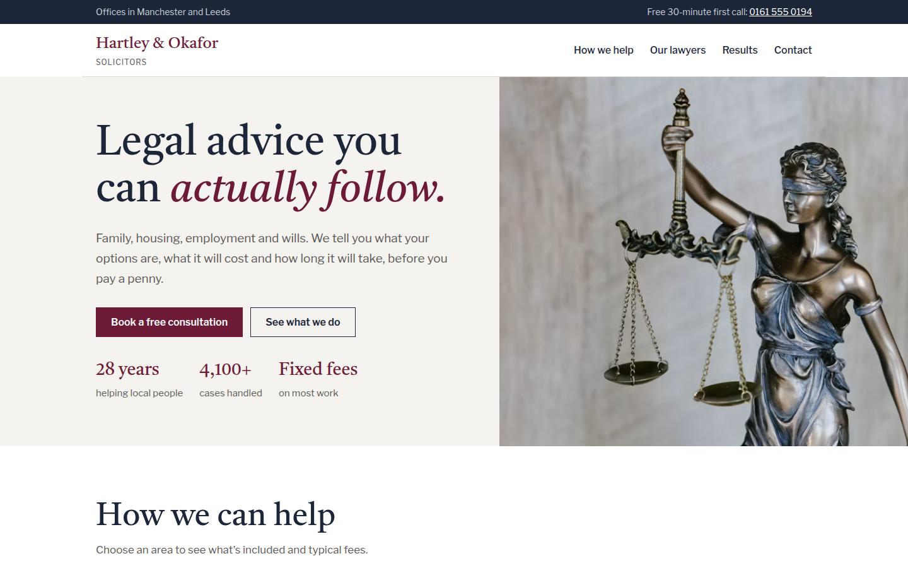](https://mmrahmanbappi.github.io/free-html-templates/local-services/law-firm/) | **[Hartley & Okafor](local-services/law-firm/)** Law Firm template  A trustworthy law firm in oxblood and stone with a classic serif. Pick a practice area to see what's included and typical fees, filter lawyers by area and book a free call.  [Live demo and download](https://mmrahmanbappi.github.io/free-html-templates/local-services/law-firm/) |
| [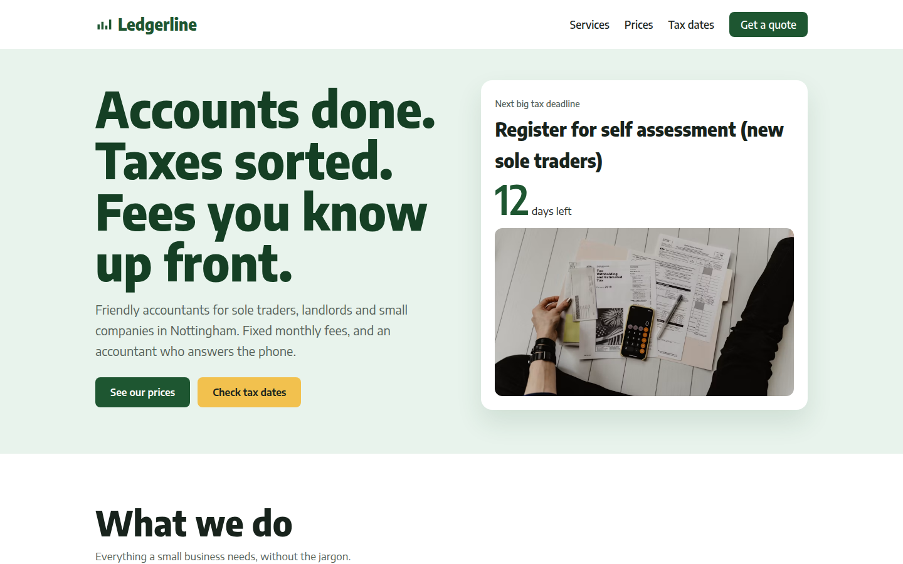](https://mmrahmanbappi.github.io/free-html-templates/local-services/accounting-firm/) | **[Ledgerline](local-services/accounting-firm/)** Accounting Firm template  A calm accountancy site in forest green and mint. Monthly plan prices change with your turnover, and the tax deadline table counts down the days and highlights what's coming up.  [Live demo and download](https://mmrahmanbappi.github.io/free-html-templates/local-services/accounting-firm/) |
| [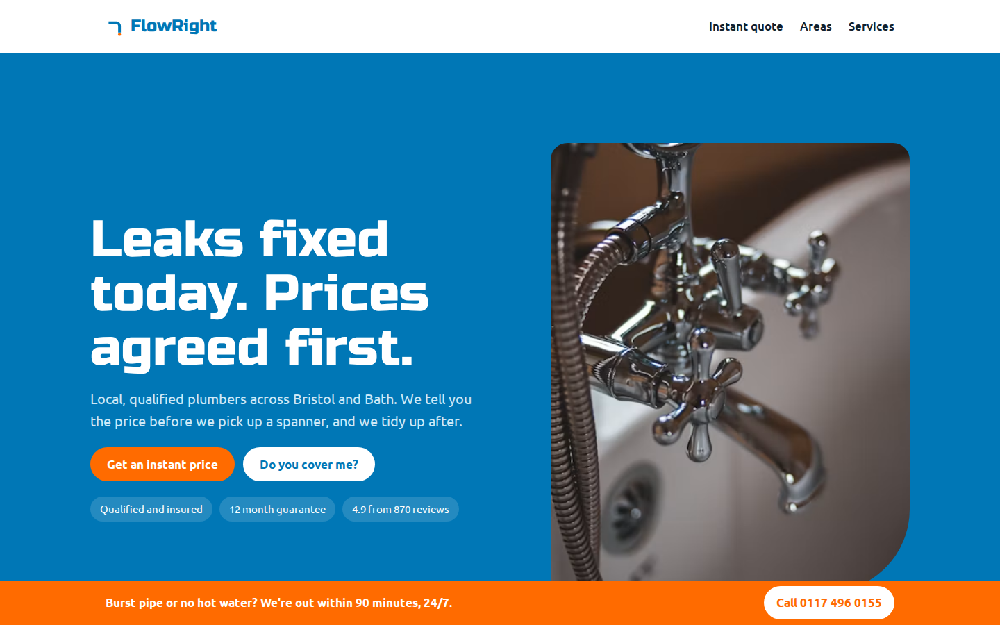](https://mmrahmanbappi.github.io/free-html-templates/local-services/plumber-home-services/) | **[FlowRight Plumbing](local-services/plumber-home-services/)** Plumber template  A bold plumbing site in water blue and safety orange with a sticky emergency call bar. Pick a job and urgency for an instant price range, and check if your postcode is covered.  [Live demo and download](https://mmrahmanbappi.github.io/free-html-templates/local-services/plumber-home-services/) |
| [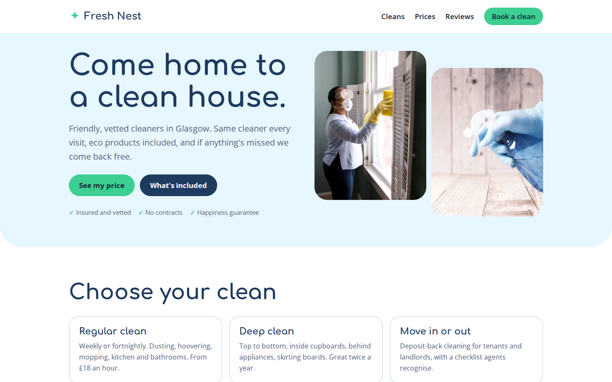](https://mmrahmanbappi.github.io/free-html-templates/local-services/cleaning-company/) | **[Fresh Nest Cleaning](local-services/cleaning-company/)** Cleaning Company template  A fresh cleaning company site in mint and sky blue. Set bedrooms, bathrooms, clean type, frequency and extras, and the price per clean updates before you book.  [Live demo and download](https://mmrahmanbappi.github.io/free-html-templates/local-services/cleaning-company/) |
| [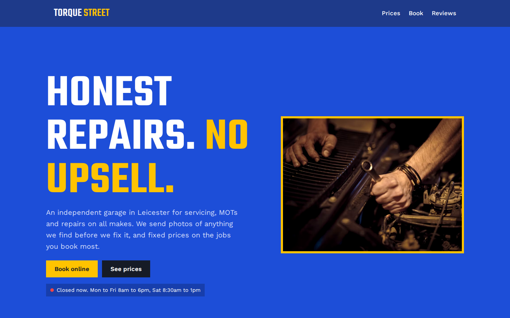](https://mmrahmanbappi.github.io/free-html-templates/local-services/auto-repair/) | **[Torque Street Garage](local-services/auto-repair/)** Auto Repair template  A workshop-tough garage site in racing blue and hazard yellow. Fixed prices for common jobs, and the booking form updates the estimate for your car size and age.  [Live demo and download](https://mmrahmanbappi.github.io/free-html-templates/local-services/auto-repair/) |
| [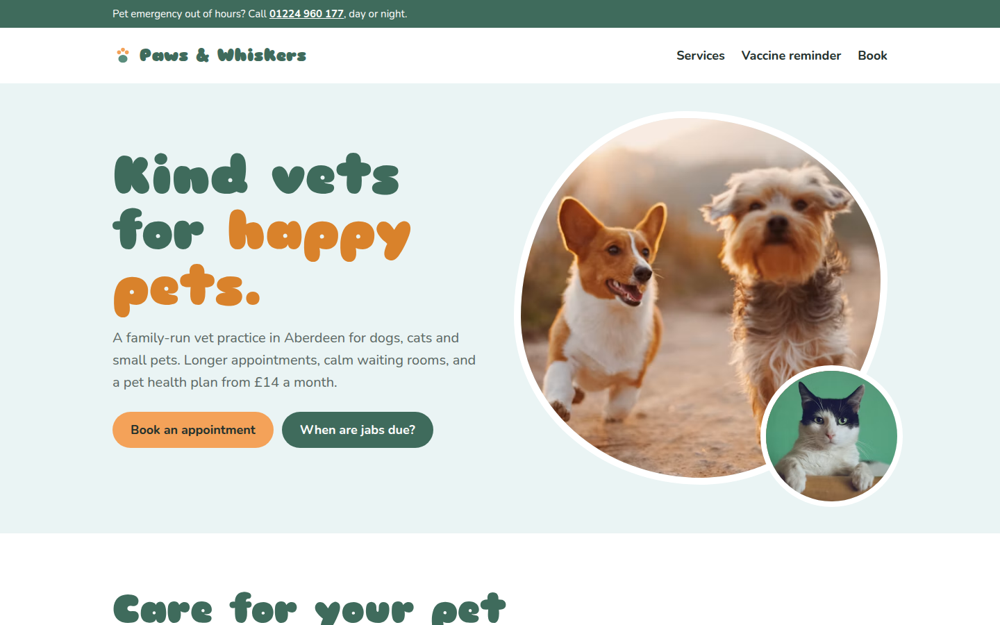](https://mmrahmanbappi.github.io/free-html-templates/local-services/pet-care-vet/) | **[Paws & Whiskers Vets](local-services/pet-care-vet/)** Vet and Pet Care template  A warm, rounded vet site in orange and sage. Pick dog, cat or rabbit to see services and prices, work out when jabs are due and add reminders to your calendar.  [Live demo and download](https://mmrahmanbappi.github.io/free-html-templates/local-services/pet-care-vet/) |
| [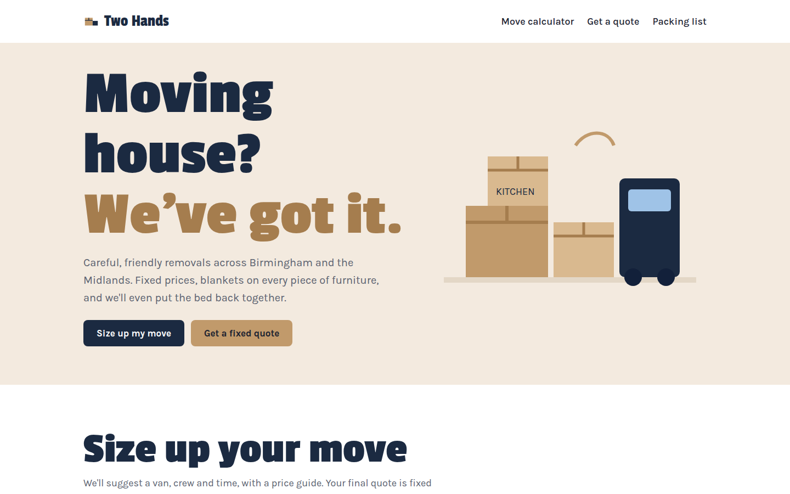](https://mmrahmanbappi.github.io/free-html-templates/local-services/moving-company/) | **[Two Hands Removals](local-services/moving-company/)** Moving Company template  A friendly removals site in cardboard brown and navy with drawn boxes. The move calculator suggests a van, crew, hours and price, and the packing checklist tracks progress by week.  [Live demo and download](https://mmrahmanbappi.github.io/free-html-templates/local-services/moving-company/) |
| [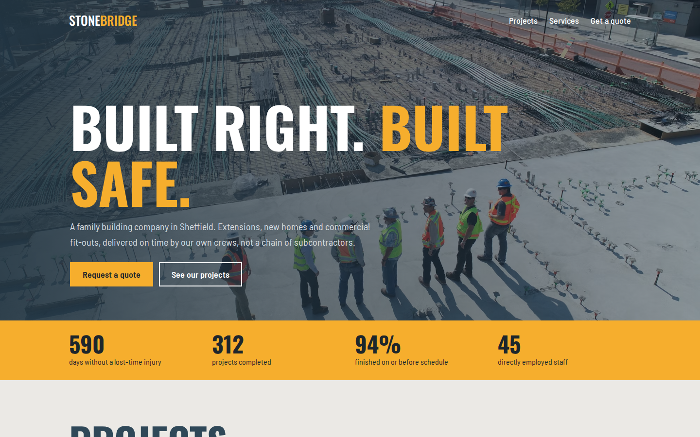](https://mmrahmanbappi.github.io/free-html-templates/local-services/construction-company/) | **[Stonebridge Build](local-services/construction-company/)** Construction Company template  A solid construction company site in steel blue, concrete and safety yellow. A live safety counter, projects filtered by type, and a quote form with a budget slider.  [Live demo and download](https://mmrahmanbappi.github.io/free-html-templates/local-services/construction-company/) |

## Categories

- **[Business](business/)** (10 templates): 10 free business website templates in one HTML file: digital marketing agency, corporate company, IT service company and more. Mobile friendly and SEO ready.
- **[AI & SaaS](saas-landing/)** (10 templates): 10 free AI & SaaS landing page templates in one HTML file: AI chatbot, SaaS product, mobile app, AI image generator and more. Mobile friendly and SEO ready.
- **[Admin Dashboard](admin-dashboard/)** (10 templates): 10 free admin dashboard templates in one HTML file: analytics dashboard, e-commerce admin dashboard, CRM dashboard and more. Mobile friendly and SEO ready.
- **[E-commerce](ecommerce/)** (8 templates): 8 free e-commerce store templates in one HTML file: fashion store, single product store, electronics store and more. Mobile friendly and SEO ready.
- **[Portfolio](portfolio/)** (8 templates): 8 free portfolio website templates in one HTML file: developer portfolio, designer portfolio, photographer portfolio and more. Mobile friendly and SEO ready.
- **[Restaurant & Food](restaurant/)** (8 templates): 8 free restaurant & food website templates in one HTML file: restaurant, cafe and coffee shop, bakery and more. Mobile friendly and SEO ready.
- **[Health & Fitness](health-fitness/)** (8 templates): 8 free health & fitness website templates in one HTML file: gym and fitness, yoga studio, personal trainer and more. Mobile friendly and SEO ready.
- **[Education](education/)** (8 templates): 8 free education website templates in one HTML file: online course, school, university, tutoring, language school and more. Mobile friendly and SEO ready.
- **[Real Estate & Travel](real-estate-travel/)** (8 templates): 8 free real estate & travel website templates in one HTML file: real estate agency, property listing and more. Mobile friendly and SEO ready.
- **[Events & Community](events-community/)** (6 templates): 6 free events & community website templates in one HTML file: wedding, conference, nonprofit and charity and more. Mobile friendly and SEO ready.
- **[Landing Pages](landing-pages/)** (8 templates): 8 free landing pages templates in one HTML file: coming soon, 404 error page, link in bio, event ticket, product launch and more. Mobile friendly and SEO ready.
- **[Local Services](local-services/)** (8 templates): 8 free local services website templates in one HTML file: law firm, accounting firm, plumber, cleaning company and more. Mobile friendly and SEO ready.

New templates are added every week. Coming next: more restaurant and food sites, portfolios, restaurants, clinics, schools, real estate and wedding sites.

## How to use a template

1. Go to the [template gallery](https://mmrahmanbappi.github.io/free-html-templates/), open a live demo and click **Download this template (free)**.
2. Open the file in a text editor such as VS Code or Notepad++.
3. Change the text, colours and photos. Colours are listed at the top of the `<style>` block.
4. Upload the file to GitHub Pages, Netlify, Cloudflare Pages or your own web host.

## Questions

**Are these HTML templates really free?** Yes. Every template is free for personal and commercial use under the MIT license. You don't need to sign up, pay or add a credit link.

**Do I need to know coding to use them?** No. Basic editing is enough. Open the index.html file in a text editor such as VS Code or Notepad, change the words, phone numbers and image links, then save the file.

**How do I put a template online for free?** Upload the index.html file to GitHub Pages, Netlify or Cloudflare Pages. All three have free plans and take about ten minutes to set up.

**Can I use a template for a client's website?** Yes. The MIT license lets you use, change and sell websites built with these templates, including work you do for clients.

**Are the templates good for SEO?** Yes. Each template has a page title and description, social sharing tags, schema markup, alt text on every image and a clear heading order, so Google can read and rank the page.

**Will the templates work on mobile phones?** Yes. Every template adjusts to phones, tablets and desktop screens, and has been checked at common screen sizes.

## Credits

Photos from [Unsplash](https://unsplash.com) under the Unsplash License. Fonts from [Google Fonts](https://fonts.google.com).

## License

[MIT](LICENSE). Free for personal and commercial use. If a template saved you time, please star this repository so more people can find it.
