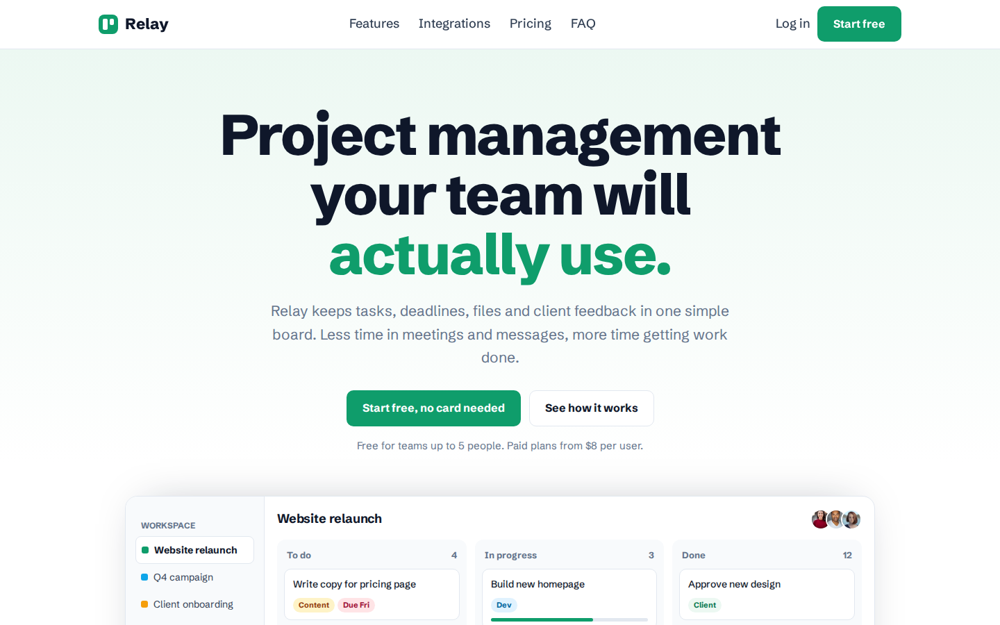

# Relay: Free SaaS Product Website Template (HTML)

A clean, green landing page for a software product. It has a full app preview built in HTML, feature sections with images, integrations, pricing with a monthly and yearly switch, a comparison table and FAQ.



**[See the live demo and download it free](https://mmrahmanbappi.github.io/free-html-templates/saas-landing/saas-product/)** &nbsp;|&nbsp; [More free templates](https://mmrahmanbappi.github.io/free-html-templates/)

## What you get

- One `index.html` file. The CSS and JavaScript are inside it, so there is nothing to install.
- Works on phones, tablets and desktops.
- SEO ready: page title, meta description, canonical link, social sharing tags and schema markup.
- Easy to read for everyone: clear headings, alt text on every image and keyboard-friendly menus.
- Loads fast: images load only when needed and the page uses just two Google Fonts.
- Full example text, written like a real business, so you can see how your finished site will read.

## Sections on the page

- Centred hero with app board preview
- Customer strip
- 3 feature rows with images
- 3 small feature cards
- Integrations grid
- Pricing with monthly/yearly toggle
- Plan comparison table
- Customer reviews
- FAQ
- Final call to action

## Fonts and colours

- **Fonts:** Schibsted Grotesk, both free from Google Fonts.
- **Colours:** Slate, emerald green, mint. You can change every colour in the `:root` section at the top of the `<style>` block.

## How to make it yours

1. Open the [live demo](https://mmrahmanbappi.github.io/free-html-templates/saas-landing/saas-product/) and click **Download this template (free)** in the black bar at the top.
2. Open the file in a text editor (VS Code, Sublime Text or Notepad++).
3. Delete the black notice bar at the top. Look for the comment `Template notice bar` and remove that block.
4. Change the business name, text, phone number, email and address.
5. Swap the photo links (they start with `https://images.unsplash.com/`) for your own photos.
6. In the `<head>`, update the title, description and the `canonical`, `og:url` and `og:image` links to your own website address.
7. Replace the schema markup with details of your own business (example below).
8. Upload the file to your web host, GitHub Pages or Netlify.

### Contact form

The form sends messages through Formspree. Make a free account at [formspree.io](https://formspree.io), create a form, and replace `your-form-id` in the form's `action` with your own form ID.

### Schema markup for your business

Replace the structured data block in the `<head>` with your own details. For a local business it looks like this:

```html
<script type="application/ld+json">
{
  "@context": "https://schema.org",
  "@type": "LocalBusiness",
  "name": "Your Business Name",
  "url": "https://www.yourwebsite.com/",
  "telephone": "+1-000-000-0000",
  "email": "hello@yourwebsite.com",
  "address": {
    "@type": "PostalAddress",
    "streetAddress": "123 Main Street",
    "addressLocality": "Your City",
    "postalCode": "00000",
    "addressCountry": "US"
  },
  "openingHours": "Mo-Fr 09:00-17:00"
}
</script>
```

## Credits

- Photos from [Unsplash](https://unsplash.com), free to use under the Unsplash License.
- Fonts from [Google Fonts](https://fonts.google.com).

## License

MIT. Use it for personal or commercial projects. A link back is nice but not required. If this template saved you time, please give the repository a star so other people can find it.

<sub>Search terms: SaaS landing page template, SaaS website template free, software product landing page HTML, free HTML template, one page website template, responsive website template download</sub>
